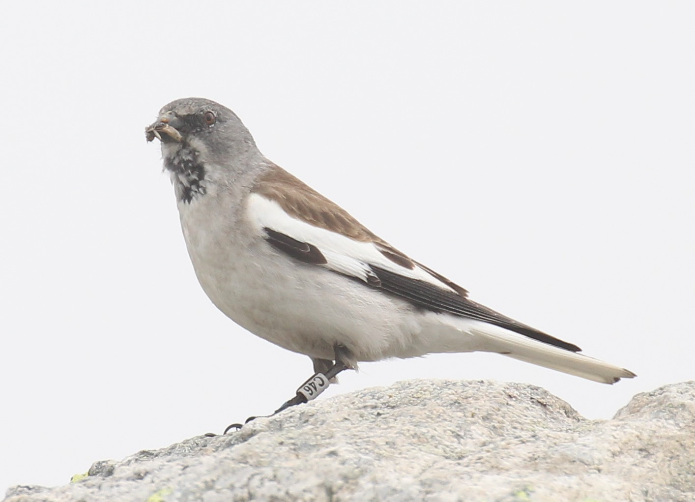
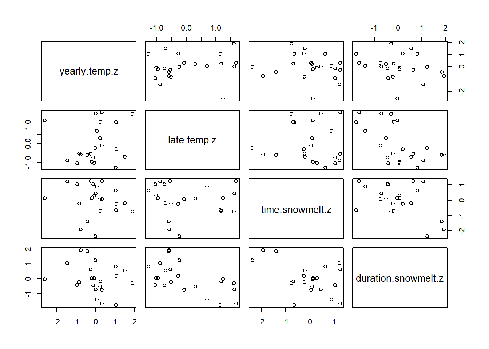
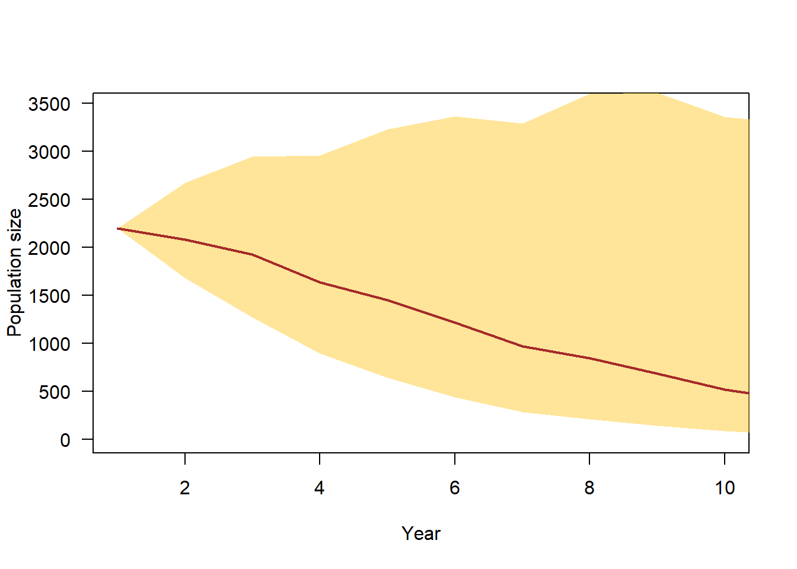

# Introduction

## Background

Global warming is changing the environment for wildlife world-wide but over proportionally in mountain areas [@Pepin.2015; @adler_cross-chapter_2022]. Exact in Alpine environments we still find specialists and endemics. To predict trends in Alpine biodiversity and for assessing the consequences of human activities for nature, the understanding of how species' population dynamics react to environmental changes is crucial. But in many cases the study of demography in species with their distribution restricted to mountain areas appears difficult because they often are rare and live in remote and inaccessible places. Therefore, such species are understudied. Any empirical data, even of low sample size, and studies on how demographic parameters and species behavior are influenced by the environment contribute to improve the understanding of how mountain specialists react to changes in the environment.  
The aim of this online material is to collate and provide demographic data together with a population model of a high-elevation specialist bird species, the White-winged Snowfinch *Montifringilla nivalis nivalis*, hereafter Snowfinch (Figure \@ref(fig:sffoto)). 

<div class="figure">

<p class="caption">(\#fig:sffoto)We use alpha-numeric plastic rings that can be read by a scope to follow individuals over their life and to study their behaviour.</p>
</div>

The presentation of the material serves several purposes: 1) The model summarises the current knowledge on population dynamics of the Snowfinch, 2) The model can be used to assess sensitivity of the population dynamics to changes in demographic parameters. 3) The model further serves to identify knowledge gaps and lack of data, 4) The model is prepared to allow for selective mating and inheritance of individual (morphological or behavioral) traits with the aim that in future it may serve to predict how traits change in the population. To estimate microevolutionary change in specific traits, however, trait heritability values would be required to do so which are just not yet available. 5) The model allows simulation of future population trajectories to predict population trends under different scenario settings such as global warming scenario, or specific conservation managements. 

The data provided to download results from our own studies. We appreciate if you contact the authors of this material first, in case you would like to use the data for your own studies. 

We do not need to be contacted, if you download the code of the population model. Other people may have developed much nicer and more efficient model codes. But we are happy if you send us suggestions for improving our code. 

## Model structure

The model consists of a pre-winter (November) and a pre-breeding (May) census of first year and adult individuals of both sexes (Figure \@ref(fig:modelstr)). The two population census within one year allows for separately modeling environmental influences on the survival from May to November ("summer survival") and from November to May ("winter survival"). 
The model also includes a pair building process. Currently, only random mating with new pairs in each year is implemented. The parameter $p$ is a vector containing three probabilities, to skip breeding, and to do one or two broods. The three probabilities sum to one. The parameter $f$ is the number of fledglings produced by a pair. We assume a sex ratio of 1:1 among fledglings.  

<div class="figure">

<p class="caption">(\#fig:modelstr)Structure of the population model. The model contains a pair building process, e.g. random pairing. It further includes demographic parameters that may depend on environmental variables: p = probability vector for doing 0, 1 or 2 broods; f = fecundity, i.e., the number of fledglings produced by one female in one breeding season; summer and winter survival for adults and first year birds of both sexes.</p>
</div>

To parameterise the model below we present the data available so far. We also collate results from earlier studies on the relationships of demographic parameters and environmental or individual specific variables. 


# Data


```
## Warning: Paket 'basemaps' wurde unter R Version 4.2.3 erstellt
```

## Environmental data

Environmental variables that have, up to now, been shown to affect population dynamics in Snowfinches are:  
- average temperature during the breeding season negatively affect apparent survival of female Snowfinches [@Strinella.2020, own data]  
- date of snowmelt was correlated with the timing of the broods [@Schano.2021] and has an effect on nestling growth rate [@Ijjas.2022]  
- temperature early in the breeding season correlated positively with the length of the breeding season (and thus, number of broods possible) and average temperature late in the breeding season correlated negatively with the length of the breeding season (Niffenegger in prep.). 

Average temperature values early and late during the breeding season, timing and duration of snowmelt were obtained from meteoschweiz for the years 1999 to 2021 [reference?].


<div class="figure">

<p class="caption">(\#fig:unnamed-chunk-1)Scatter plot of (standardised) temperature early and late during the breeding season, time and duration of snowmelt. All variables are standardised so that their mean is zero and their standard deviation one.</p>
</div>


## Demographic data

### Number of broods


The number of broods a female raises in one year is only known for a few study sites. In the Apennine, 26 out of 26 females did a second brood [@strinella_biologia_2011]. In the Pyrenees, @grange_biologie_2008 observed that 50% of the breeding pairs did a second brood. Little is known for the Alps. @Aichhorn.1966 found in the Austrian Alps that 9 of 11 breeding pairs did a second brood. In our study in the Swiss Alps, we could detect only 7 females doing a second brood out of 48 females that were reported to breed. However, we may have missed a large part of the second broods because females may leave the study area for the second brood. 
The proportion of non-breeding females is not known at all.

To more precisely assess the proportion of females that skip breeding, do one or two broods, it would be necessary to track females over the course of the whole breeding season. This has not been done yet. 

We use a hierarchical meta-analysis to combine the information from the different studies including our own. To do so, we use a binomial mixed model for the number of females that were reported to do a second brood. The study was used as a random factor to account for among-study variance. 

<div class="figure">

<p class="caption">(\#fig:metanrbrood)Reported proportion of second broods in different studies (point) with 95% uncertainty intervals. The mean (grey) is the average overa all studies, taking different sample sizes into account. The sample sizes, i.e. number of females doing at least one brood, are given for each study.</p>
</div>

The resulting average proportion of second broods has a high uncertainty. Its 95% uncertainty interval ranges from 0.22 to  0.97, and the mean is 0.75 (Figure \@ref(fig:metanrbrood)).


For the population model, we use a proportion of non-breeding females of 0.1 in average and an uncertainty interval of 0.03 to 0.22 to account for the fact that we know little about this demographic parameter. 

We derive the two intercepts of a multinomial model from the proportion of non-breeders and the proportion of females with second broods among the breeding females using Monte Carlo simulations to propagate the uncertainty. The proportions defined by the intercept are used for average temperature values. 


Citizen science data (ornitho.ch) revealed that during the last 20 years, the Snowfinch breeding season started mid May when June temperatures were high and it started mid June, when June temperatures were low (Niffenegger in prep.). Also, we saw that the end of the breeding season varied between the beginning of August to the end of August depending on July temperature. The warmer in July, the earlier was the end of the breeding season. Thus, both temperature variables (June and July temperature) may affect the number of broods by one brood (for which around one month is needed) along their ranges of values. We derive effect sizes for June and July temperature that correspond to a change by one brood from the lowest to the highest temperature values. 


<div class="figure">

<p class="caption">(\#fig:unnamed-chunk-3)Proportion of females with 0, 1 or 2 broods. The 95% uncertainty intervals are indicatd with white dotted lines. They visualise the lack of knowledge on the proportion of breeders and the proportion of second broods, as well as the uncertainty in the temperature effects.</p>
</div>


### Number of fledglings


There is only one study from the Pyrenees that report the number of fledglings [@grange_biologie_2008]. They report an average of 2.4. 


### Survival

#### Literature view on survival estimates for Snowfinches

There is, as far as we know, only one published study on apparent survival in Snowfinches from the Appennine [@Strinella.2020]. The mark-recapture study took place between 2003 and 2017, and a couple of different mark-recapture models accounting for transients [@Pradel.1997] were used to estimate annual apparent survival. Depending on the model used, they found annual apparent survival to be between 0.51 and 0.64 for adult females, between 0.44 and 0.54 for adult males and between 0.09 and 0.13 for first year birds. In addition, they found a strong negative correlation between apparent annual survival of adult females and average temperature during the breeding season. In the Austrian Alps, Ambros Aichhorn regularly ringed Snowfinches between 1964 and 2004 in winter. Also in these data, a strong negative correlation between temperature during the breeding season and female apparent survival is visible (own analyses in prep.). The average apparent annual survival was 0.63 (95% 0.56 -  0.70) in males and 0.50 (0.36 - 0.64) in females [@zauner_apparent_2022].

#### Own data on survival

In the project at the Swiss Ornithological Institute, we are marking individuals between since May 2015 and we perform systematic searches for marked individuals. Until August 2023 we collected over 8000 resightings and over 900 recaptures (Fig. \@ref(fig:dataprepsurv)). Here, we present first, preliminary, analyses of those data and analyses results. The results are far from being perfect. The analyses serve to get an impression on how well we can estimate apparent survival, to identify gaps in the data and lack of knowledge, so that we can better plan our future research activities. 

<div class="figure">

<p class="caption">(\#fig:dataprepsurv)Marking- and capture/resighting data of Snowfinches in the project of the Swiss Ornithological Institute. Individuals are presented on the y-axis, the time is given on the x-axis. Dots are captures (blue as nestling, orange as fledged bird), open circles are resightings and brown crosses are findings of dead birds. Horizontal lines connect recaptures, resightings or findings of the same individual.</p>
</div>

We used alpha-numeric plastic rings to enable resightings of birds. Likely due to the cold in winter, the plastic rings break and get lost after some months. Birds without plastic rings only can get recaptured but no longer resighted. To account for that loss of plastic rings, we usesd a multi-state/multi-event model [@Arnason.1972, @pradel_multievent_2005] adapted so that it accounts for loss of plastic rings [@laake_hidden_2014]. We divided the study period into 3-months intervals and collated the capture-recapture/resightings into an observation history matrix with a row per individual and plastic ring respectively. When an individual that has lost its plastic ring got a new plastic ring on a recapture, we defined that recapture to be a new release, i.e. we added a new observation history to the data matrix. Following @laake_hidden_2014, we defined that the birds can be in 3 different states: 1=alive with metallic and plastic ring, 2=alive with metallic ring only, 3= dead. Transitions between states $T$ were defined by apparent survival probability $\phi$ and the probability to lose a plastic ring $m$.  

\[T = 
  \left[ {\begin{array}{ccc}
    (1-m)\phi_{i,t} & m\phi_{i,t} & 1-\phi_{i,t} \\
    0 & \phi_{i,t} & 1-\phi_{i,t}\\
    0 & 0 &  1\\
  \end{array} } \right]
\]

Observation events are 1=individual is recorded wearing its plastic ring (resightings and recaptures), 2=individual is recorded without plastic ring (e.g. a recapture), 3=individual has not been seen or recaptured during the 3-months interval. We defined two different probabilities to record an individual during a 3-months interval, one for individuals having a plastic ring $p^*$ and one for individuals without a plastic ring $p$. Depending on the state of the individuals, they can be recorded according to the observation matrix: 

\[O = 
  \left[ {\begin{array}{ccc}
    p^* & 0 & 1-p^* \\
    0 & p & 1-p\\
    0 & 0 &  1\\
  \end{array} } \right]
\]

Apparent survival and recapture/resighting probabilities were estimated independently for each age class (first half year vs. older than half a year), sex and season. We assume that ring loss probability is constant. 

The preliminary results presented here, need to be handled with care because important relevant structures are still missing from the model. For example:  

- Probability that a plastic ring is lost varies among ring series. A random factor for the ring series could be added as predictor for re-sighting probability $p^*$.  

- Many individuals are first captured in winter which makes it likely that our data contains a high amount of so-called transients, i.e. individuals that are marked and then move away from our study site. It could be accounted for such transients in the model.  

- No among-year variance in apparent survival is yet included in the model.  

- No among-individual variance in apparent survival nor in recapture/resighting probability other than age and sex is included in the model yet.  

- First year birds are only treated as first year birds until December. Later, it is assumed that apparent survival of these birds is equal to adults (see below).  

- Resightings made outside our study area could be used to model movements and, consequently, we could get closer to true instead of apparent survival. 


We are happy to hear of further thoughts and ideas on how to improve the survival estimation. 

We fitted the model using Markov chain Monte Carlo simulations as implemented in Jags [@Plummer2003]. The Jags code is provided in the code repository of this Github project. 


<div class="figure">

<p class="caption">(\#fig:survest)Three-months apparent survival estimates for juvenile (first half year) and adult Snowfinches in the Swiss Alps. Vertical bars are 95% intervals of the posterior distributions.</p>
</div>

The preliminary results indicate that adult apparent survival is lowest in late winter and may be lower in females compared to males in late summer. Apparent survival of the freshly fledged birds in late summer may be underestimated because we assume that during the second half of their first year, their apparent survival equals adult apparent survival, which may not be true. However, after the post-juvenile moult in late summer, first year and older birds are no longer distinguisable. Therefore, of birds captured for the first time in winter, we only know that they are at least half a year old. To be able to estimate separate first year apparent survival for the whole first year, we would need to deal with unidentified ages. 


From our preliminary model, we get an annual apparent survival estimate for adult females of 0.45 (95% CrI: 0.39 - 0.51), for adult males 0.54 (0.51 - 0.57), and of first year females 0.14 (0.06 - 0.29), and for first year males 0.09 (0.04 - 0.16).

Table: Half-year apparent survival estimates (preliminary results). Note, winter apparent survival of first years is assumed to be equal to adult apparent survival. 

| Age |  Sex | Apparent survival May - Nov | Apparent survival Nov - May| 
|:---|---:|----:|----:|
|first year | female | 0.24 (0.1 - 0.46) | 0.71 (0.57 - 0.88)|
|first year | male |  0.15 (0.07 - 0.26)| 0.72 (0.65 - 0.79)|
|adult| female |  0.63 (0.5 - 0.79) |0.71 (0.57 - 0.88) |
|adult | male | 0.75 (0.68 - 0.83)  | 0.72 (0.65 - 0.79) |


#### Survival function of the predictive population model

From the survival analyses that are available up to now, we collated a survival function that produces a survival probability for summer and winter for each age and sex class dependent on a standardised environmental variable (Fig. \@ref(fig:survivalfunctions)). Intercepts are taken from the analyses of our own data (presented above) and effect of the environmental variables are taken from the long-term data from Austria [@zauner_apparent_2022]. For every run of the population model, we draw a random intercept and slope for each age and sex class and we keep that values for the whole population trajectory. In this way, the uncertainty of survival propagates into the uncertainty of the population trajectory. 


<div class="figure">

<p class="caption">(\#fig:survivalfunctions)Survival function used in the predictive population model.</p>
</div>


# Population model

## Starting population

We start with a population just before the breeding season with 1000 adult females, 1000 adult males and 100 first year birds of each sex. 


## Run population trajectory

To simulate the population trajectory, we follow the structure presented in Figure \@ref(fig:modelstr). The steps are the following:  

1. Build breeding pairs: With the females and  males present in the population, the breeding pairs are formed. The number of brereding pairs corresponds to the minimum of the number of males and females.  

2. The number of broods per breeding pair is simulated based on the temperature early and late in the breeding season.   

3. Number of fledglings per brood is simulated based on the date of the brood.   

4. Summer and winter survival is simulated for each individual and the simulations started at step 1. with the individuals that survived until the beginning of the following breeding season.  


<div class="figure">

<p class="caption">(\#fig:vispop)90% range of simulated population trajectories based on current knowledge on demographic parameters. The variance in the trajectories reflects current uncertainties of demographic parameters.</p>
</div>

# References

