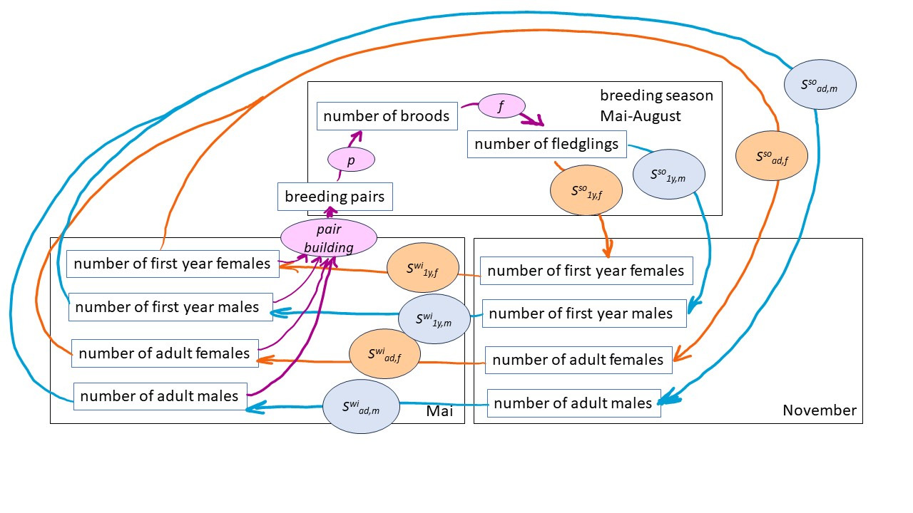
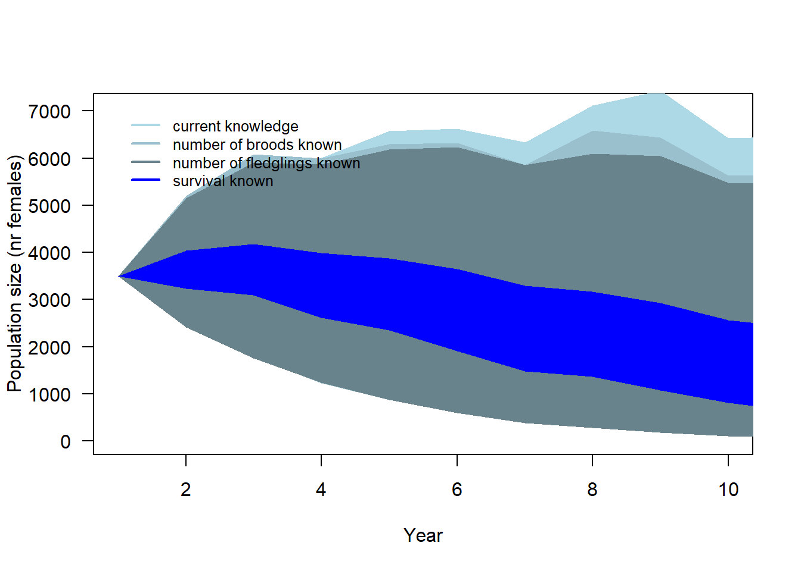

# Introduction

## Background

Global warming is changing wildlife's environments world-wide, with a disproportionate impact in mountain regions [@Pepin.2015; @adler_cross-chapter_2022]. Especially in the Alpine environments, we find species that are specialists and endemics. For predicting Alpine biodiversity trends and assessing the consequences of human activities for nature, the understanding of how species' population dynamics respond to environmental changes is crucial. However, studying demography of species that exclusively live in mountainous regions can be challenging due to their rarity and residence in remote and inaccessible locations. Therefore, these species remain understudied. Any empirical data or study on the influence of environmental factors on demographic parameters and species behaviour, even  with limited sample size, can enhance our understanding of how mountain specialists react to environmental changes.  
The aim of this online material is to compile and provide demographic data together with a population model of a high-elevation specialist bird species, the White-winged Snowfinch *Montifringilla nivalis nivalis*, hereafter Snowfinch (Figure \@ref(fig:sffoto)). 

<div class="figure">

<p class="caption">(\#fig:sffoto)We use alpha-numeric plastic rings that can be scanned by a scope to track individuals throughout their lifespan and observe their behaviour.</p>
</div>

The presentation of the material serves several purposes: 1) The model summarises the current knowledge on population dynamics of the Snowfinch, 2) The model can be used to assess the sensitivity of population dynamics to changes in demographic parameters. 3) The model aids in identifying knowledge gaps and areas lacking data, 4) The model is designed to facilitate selective mating and the inheritance of individual (morphological or behavioural) traits. In the future it may enable to predict how traits change in the population. Microevolutionary change in specific traits, however, can only be addressed if trait heritability values are available, which is currently not the case for the Snowfinch. 5) The model enables the simulation of future population trajectories, allowing predictions of population trends under various scenario such as global warming scenarios or specific conservation management strategies. 

The data provided here originates from our ongoing study. We appreciate if you contact the authors, in case you would like to use the data for your own studies.

If you only download the code of the population model, there is no need to contact us. Other people may have developed much nicer and more efficient model codes. But we are happy if you send us suggestions for improving our code.


## Model structure

The model consists of a pre-winter (November) and a pre-breeding (May) census of first-year and adult individuals of both sexes (Figure \@ref(fig:modelstr)). Keeping the populations in May and November separately allows for separate modelling of environmental influences on survival from May to November ("summer survival") and from November to May ("winter survival"). 
The model also incorporates a pair-building process. Currently, only random mating with new pairs formed each year is implemented. The parameter $p$ is a vector containing three probabilities, to skip breeding, and to do one or two broods. The three probabilities sum up to one. The parameter $f$ is the number of fledglings produced by a pair. We assume a sex ratio of 1:1 among fledglings.  

<div class="figure">

<p class="caption">(\#fig:modelstr)Structure of the population model. The model incorporates a pair-building process. Additionally, it includes demographic parameters that may depend on environmental variables: p = probability vector for doing 0, 1 or 2 broods; f = fecundity, i.e., the number of fledglings produced by one female in a single breeding season; and summer and winter survival rates for adults and first year birds of both sexes.</p>
</div>

To parameterise the model, we present the currently available data below. Furthermore, we compile results from earlier studies on the relationships of demographic parameters and environmental or individual-specific variables.


# Data


## Environmental data

Correlations between Snowfinch population dynamics and environmental variables are supported by empirical evidences from the following studies:  

- A negative correlation was found between the average ambient temperature during the breeding season and apparent survival of female Snowfinches in the Apennines between 2003 and 2017 [@Strinella.2020].  

- In the Austrian Alps between 1964 and 2004, the average ambient temperature during the breeding season showed a strong negative correlation with female apparent survival and moderate negative correlation in males [@hille_are_nodate].  

- The timing of broods was correlated with early spring precipitation but did not follow the long-term advance of the snow melt in citizen science data from Switzerland from 1998 to 2019 [@Schano.2021].  

- Nestling growth rate was higher during snow melt compared to after snow melt in 87 nestlings of 24 broods in the Swiss Alps (data from 2016 to 2020) [@Ijjas.2022].  

- Temperature early in the breeding season correlated positively with the length of the breeding season (and consequently, the number of broods possible), while average temperature late in the breeding season correlated negatively with the length of the breeding season as inferred from citizen science data in Switzerland between 1999 and 2021 [@niffenegger_how_nodate]. 


In the current version of the population model, we relate the number of broods per female and year, and survival (first-year and adult female and male survival) to temperature during the breeding season. We use average temperature values for the Swiss Alps early and late in the breeding season as predicted by the climate scenario RCP26 [@ch2018_project_team_ch2018_2018]. We use these data to have a somewhat realistic among-year variance in temperature values for simulating the population trajectories.  


## Demographic data

### Number of broods


The total number of broods a female raises in one year is only known for a few study sites. In the Apennines, all 26 females observed did a second brood [@strinella_biologia_2011]. In the Pyrenees, @grange_biologie_2008 noted that 50% of the breeding pairs undertook a second brood. Little is known for the Alps. @Aichhorn.1966 reported that 9 of 11 breeding pairs did a second brood in the Austrian Alps. In our study in the Swiss Alps, we found that only 7 out of 49 females reported to breed did a second brood. However, we might have missed a large part of the second broods because females may leave the study area for the second brood. 
The proportion of non-breeding females is not known at all.

To more precisely evaluate the proportion of females skipping breeding, doing one or two broods, tracking of females throughout the entire breeding season would be needed. This has not been accomplished yet. 

We employ a hierarchical meta-analysis to combine the information from the different studies, including our own. To this end, we use a binomial mixed model for the number of females reported to do a second brood, with the study as a random factor to account for among-study variance. 

<div class="figure">

<p class="caption">(\#fig:metanrbrood)Proportion of second broods in different studies (point) with 95% uncertainty intervals. The mean (grey) represents the average across all studies, accounting for different sample sizes. The sample sizes, i.e. number of females doing at least one brood, are given for each study.</p>
</div>

The resulting average proportion of second broods exhibits a high uncertainty. Its 95% uncertainty interval ranges from 0.2 to  0.97, and the mean is 0.75 (Figure \@ref(fig:metanrbrood)).


For the population model, we adapted an average proportion of non-breeding females of 0.1 along with an uncertainty interval of 0.03 to 0.23. The large uncertainty interval accounts for the fact that we know little about this demographic parameter. 

Using Monte Carlo simulations to propagate the uncertainty, we derived two intercepts for a multinomial model based on the proportion of non-breeders and the proportion of females with second broods among the breeding females. The proportions (of non-breeders, females with one and two broods) defined by the intercepts were used for average temperature values in our model. 


Citizen science data (ornitho.ch) from the last 20 years revealed that the Snowfinch breeding season in Switzerland started already mid-May when June temperatures were high but it started mid-June, when June temperatures were low (Niffenegger in prep.). Additionally, we saw a variation in the ending of the breeding season depending on July temperature. Higher temperatures in July led to an earlier end of the breeding season. Thus, both June and July temperature may affect the total number of broods per year and female. Both variables affected the start and end of the breeding season, respectively, by around one month along the range of their values. A brood needs around one month to be completed. Therefore, we included June and July temperature as predictors in the function use to simulate the number of broods per female and year so that the average number of broods differed by one between the lowest and the highest temperature values. 


<div class="figure">

<p class="caption">(\#fig:funnrbrood)Proportion of females with 0, 1 or 2 broods. The 95% uncertainty intervals are depicted with white dotted lines. They visualise the lack of knowledge on the proportion of breeders and the proportion of second broods, as well as the uncertainty in temperature effects.</p>
</div>


### Number of fledglings


There is only one study from the Pyrenees that reported the number of fledglings [@grange_biologie_2008]. They found an average of 2.4 fledglings per brood. 


Our own data from Switzerland (2015-2023) contains 83 broods for which the number of fledglings is known. The average number of fledglings was almost 4 chicks for broods early in the breeding season and it decreases to around 3 fledglings for late broods (Fig. \@ref(fig:nrfeldglings)).

<div class="figure">

<p class="caption">(\#fig:nrfeldglings)Number of fledglings in relation to the date on which the first egg of the brood hatched. The regression line was generated by a linear mixed model with hatching date as predictor and year as random factor. The 95% CI is given as dotted lines. Dots are slightly jittered along the y-axis.</p>
</div>

To simulate the population trajectory, we drew the number of fledglings for each brood from a normal distribution centred around the mean number of fledglings, determined by the hatching date, with a standard deviation of 1.15. The standard deviation corresponds to the residual standard deviation of the regression shown in Figure \@ref(fig:nrfeldglings). Currently, we are not considering the among-year variance due to its small magnitude in our data  (SD among years: 0.28). However, we may incorporate among-year variance once we gather better data on how environmental variables influence the number of fledglings. Finally, the drawn values of the number of fledglings were rounded to the nearest integer in the simulations.


### Survival

#### Literature view on survival estimates for Snowfinches

To our knowledge so far, there is only one published study on apparent survival in Snowfinches [@Strinella.2020]. The mark-recapture study took place between 2003 and 2017 in the Appenines, and a couple of different mark-recapture models accounting for transients [@Pradel.1997] were used to estimate annual apparent survival. Depending on the model used, they found annual apparent survival to be between 0.51 and 0.64 for adult females, between 0.44 and 0.54 for adult males and between 0.09 and 0.13 for first year birds. In addition, they discovered a strong negative correlation between apparent annual survival of adult females and average temperature during the breeding season. Similarly, Ambros Aichhorn ringed Snowfinches in the Austrian Alps between 1964 and 2004, which also depicted a strong negative correlation between female apparent survival and temperature during the breeding season [@hille_are_nodate]. The averages apparent annual survival were identified to be 0.63 (95% 0.56 -  0.70) in males and 0.50 (0.36 - 0.64) in females [@zauner_apparent_2022;  @hille_are_nodate].

#### Own data on survival


```r
load("data/datax.rda")
```

In our study at the Swiss Ornithological Institute, we have been marking over 1600 individuals since May 2015 and conducting systematic searches for marked individuals. Until August 2023 we collected over 8000 resightings and over 900 recaptures (Fig. \@ref(fig:dataprepsurv)). In this section, we present preliminary analyses and results based on the 1580 individuals marked before June 2023. While the results are far from being perfect, they provide an initial understanding of how well we can estimate apparent survival. Furthermore, they help us to identify gaps in the data and areas where knowledge is lacking, enabling us to better plan our future research activities. 

<div class="figure">

<p class="caption">(\#fig:dataprepsurv)Marking- and capture/resighting data of Snowfinches in the project at the Swiss Ornithological Institute. While individuals are listed on the y-axis, the x-axis corresponds to the timeline. Captures are depicted as dots, with blue indicating nestling and orange representing fledged birds. Resightings are represented by open circles, and dead recoveries are depicted by brown crosses. Horizontal lines connect recaptures, resightings or dead recoveries of the same individual</p>
</div>

We used alpha-numeric plastic rings in addition to the official aluminium ring of the Swiss ringing scheme to enable resightings of birds. However, due to the cold winter conditions, these plastic rings in some cases break and become lost after some months. Birds without plastic rings have to be recaptured, because they can  no longer be individually identified by resighting alone. To account for the loss of plastic rings, we used a multi-state model designed to incorporate loss of marks described by @laake_hidden_2014 which we adapted for the Snowfinch data. In contrast to the Black bear *Ursus americanus* data of @laake_hidden_2014, where only a sub-sample of individuals had a permanent mark, all our captured individuals had a permanent mark, i.e., the aluminium ring. Further, in our data, recapture/resighting probability depended on whether the bird has a plastic ring because only the code on the plastic rings but not the one on the aluminium ring can be identified with a scope. 

Data organisation: We divided the study period into 3-months intervals and we organised the capture-recapture/resightings into a history matrix with each row representing an individual. When an individual that has lost its plastic ring was recaptured and given a new plastic ring, we defined that recapture to be a new release, thus adding a new row to the history matrix $y$. Thus, the number of rows in the history matrix corresponded to the number of unique bird-plastic ring combinations, and $y_{i,t}$ contained the observation event of the bird-plastic ring combination $i$ in time interval $t$. The observations were categorised as follows: 1=individual is recorded wearing its plastic ring (a resighting or a recapture of the individual wearing its plastic ring), 2=individual is recorded without plastic ring (a recapture of the individual without plastic ring), 3=individual has not been seen or recaptured during the 3-months interval.   

Model for the biological process: Following the approach from @laake_hidden_2014, we defined that a bird $i$ can be in 3 different states at each time interval $t$, $C_{i,t}$: 1=alive with both metallic and plastic ring, 2=alive with only the metallic ring, 3= dead. Transitions between states were defined by apparent survival probability $\phi$ and the probability to lose a plastic ring $\theta$. The parameters $\phi$ and $\theta$ used to construct the transition matrix $T$ that defines on each row with what probability a bird in state $C_{i,t-1}$ changes its state to state $C_{i,t}$ (columns of $T$). 

\[T = 
  \left[ {\begin{array}{ccc}
    (1-\theta)\phi_{i,t} & \theta\phi_{i,t} & 1-\phi_{i,t} \\
    0 & \phi_{i,t} & 1-\phi_{i,t}\\
    0 & 0 &  1\\
  \end{array} } \right]
\]


Model for the observation process: We defined two different probabilities to record an individual during a 3-months interval, one for individuals with a plastic ring $p^*$ and another for individuals without a plastic ring $p$. Individuals are recorded with recapture/resighting probabilities defined in the observation matrix (rows depict state $C_t$ and columns observation $y_{i,t}$): 

\[O = 
  \left[ {\begin{array}{ccc}
    p^* & 0 & 1-p^* \\
    0 & p & 1-p\\
    0 & 0 &  1\\
  \end{array} } \right]
\]

Likelihood: We used a categorical distribution for the observations $y_{i,t} \sim categorical(\mathbf{p}_{i,t})$ with $(\mathbf{p})_{i,t} = I_i \times T_{i,1} \times ... \times T_{i,t-1}\times O_{i,t}$ where  $I_i$ is an indicator of the initial state of the bird-plastic ring combination, i.e. $$\begin{pmatrix} 
1 \\ 
0 \\
0 \\
\end{pmatrix}$$
for birds released with a plastic ring and $$\begin{pmatrix} 
0 \\ 
1 \\
0 \\
\end{pmatrix}$$ for birds released without plastic ring.  

Apparent survival and recapture/resighting probabilities were estimated independently for each age class (first half year vs. older than half a year), sex and season.  
$\phi_{i,t} = logit^{-1}(\beta[age[individual[i], t], sex[individual[t]], season[t]])$  

$p^*_{i,t} = logit^{-1}(\alpha^*[age[individual[i], t], sex[individual[t]], season[t]])$  

$p_{i,t} = logit^{-1}(\alpha[age[individual[i], t], sex[individual[t]], season[t]])$  

We assume that the probability of losing a plastic ring $\theta$ remains constant. 


It is important to carefully interpret the preliminary results presented here, as important relevant structures are still missing from the model. For example:  

- The probability of losing a plastic ring may vary among different ring series.   

- Many individuals are first captured during winter, thus it is probable that our data contains so-called transients, i.e. individuals that are marked but then moved away from the study site. It would be possible to account also for such transients in the model.  

- Among-year variance in apparent survival is not yet included in the model.  

- Among-individual variance in either apparent survival or in recapture/resighting probability other than age and sex is not yet included in the model.  

- First year birds are only treated as first year birds until December, after which their apparent survival is assumed to be equal to that of adults (see below).  

- Resightings made outside our study area (currently 25 cases) could be used to model movements, enabling estimation of true survival instead of apparent survival. 


We welcome any further thoughts and ideas to improve the survival estimation. 

We fitted the model using Markov chain Monte Carlo simulations as implemented in Jags [@Plummer2003]. The Jags code is provided in the code repository of this Github project. 


<div class="figure">

<p class="caption">(\#fig:survest)Three-months apparent survival estimates for juvenile (first half year) and adult Snowfinches in the Swiss Alps. Vertical bars are 95% intervals of the posterior distributions.</p>
</div>

Our preliminary results suggest that adult apparent survival is lowest in late winter. Survival may be lower in females compared to males in late summer. Apparent survival of the freshly fledged birds in late summer might be underestimated as we currently assume that during the second half of their first year, their apparent survival equals that of adults, which may not be accurate. However, after the post-juvenile moult in late summer, first year and older birds become indistinguishable. This means that we can only confirm that birds captured for the first time in winter are at least half a year old. To separately estimate the apparent survival of first-year birds for the entire span of their first year, we would need to deal with unidentified ages. 


Preliminary results from our model, yielded an annual apparent survival estimate for adult females of 0.45 (95% CrI: 0.39 - 0.51), for adult males 0.54 (0.51 - 0.57), and of first year females 0.14 (0.06 - 0.29), and for first year males 0.09 (0.04 - 0.16).

Table: Half-year apparent survival estimates (preliminary results). Note, winter apparent survival of first years is assumed to be equal to adult apparent survival. 

| Age |  Sex | Apparent survival May - Nov | Apparent survival Nov - May| 
|:---|---:|----:|----:|
|first-year | female | 0.24 (0.1 - 0.46) | 0.71 (0.57 - 0.88)|
|first-year | male |  0.15 (0.07 - 0.26)| 0.72 (0.65 - 0.79)|
|adult| female |  0.63 (0.5 - 0.79) |0.71 (0.57 - 0.88) |
|adult | male | 0.75 (0.68 - 0.83)  | 0.72 (0.65 - 0.79) |

The probability that a plastic ring is lost within three months was estimated to be 0.027 (0.02 - 0.037), indicating that one year after receiving a plastic ring, approximately 10.47% of the individuals are expected to have lost their plastic ring. 

#### Survival function of the predictive population model

Based on the available survival analyses, we compiled a survival function that generates a survival probability for summer and winter for each age and sex class, dependent on a standardised environmental variable  (Fig. \@ref(fig:survivalfunctions)). The intercepts defining the average survival for an average value of the environmental variable were derived from the analyses of our own data (presented above), while the effects of the environmental variables were based on the long-term study from Austria [@hille_are_nodate]. For each run of the population model, we draw a random intercept and slope for each age and sex class, retaining these values for the entire population trajectory. This approach ensures that the uncertainty of survival propagates into the uncertainty of the population trajectory. 


<div class="figure">

<p class="caption">(\#fig:survivalfunctions)Survival function used in the predictive population model.</p>
</div>


# Population model

## Starting population

We initiated the model with a population of 7000 individuals just before the breeding season (pre-breeding census), consisting of 1000 adult females, 1000 adult males and 2500 first year males and females each. This age composition corresponds to a stable age structure of a population with a fecundity of 2.5, first year survival of 0.2 and adult survival of 0.5. 


## Run population trajectory

To simulate the population trajectory, we follow the structure presented in Figure \@ref(fig:modelstr). The steps are the following:  

1. Building breeding pairs: Matching females and males in the population to form the breeding pairs. The number of breeding pairs corresponds to the minimum number of males and females.  

2. The number of broods per breeding pair is simulated based on the early and late temperatures in the breeding season, as shown in Figure  \@ref(fig:funnrbrood). At this step a certain proportion of pairs are designated as non-breeders (having zero broods).    

3. The number of fledglings per brood is simulated based on the date of the brood (as shown in Figure \@ref(fig:nrfeldglings)). To keep the model simple for the moment, we assume that the first broods hatch at day 162 and the second broods at day 190.

4. Summer and winter survival is simulated for each individual assuming a survival probability determined by the functions depicted in Figure \@ref(fig:survivalfunctions). We use the average temperature during breeding season (average over early and late) as predictor for survival.  

5. Subsequently, the simulation resumes with step 1, involving the individuals that survived until the onset of the following breeding season.  


## Predicted population trajectories


Based on our incorporated information, i.e. the number of broods per female and year, the number of fledglings per brood, and survival rates, the model predicted that a population of 3500 females decreases in average to around 1000 within 10 years  (Figure \@ref(fig:vispopcurrentknow)). The population trend is 0.85 (95% CI: 0.66 - 1.1).  


Before the population trajectory can be used as a prediction for the future of Snowfinch populations, several refinement points need to be addressed in the population model, such as:  

- Our model currently uses estimates for apparent survival as average survival instead of true survival. This may lead to an underestimation due to the lower values of apparent survival, a product of fidelity to the study area and overall survival, compared to true survival. This discrepancy can be mitigated by accounting for emigration in the survival model (see above) or we could gradually increase the survival estimates in the population model until the resulting trend corresponds to the observed population trend in Switzerland  (https://www.vogelwarte.ch/de/voegel-der-schweiz/schneesperling/).  

- The (standardised) temperature values used to simulate among-year variance in the number of broods and survival should be recorded relative to the temperature when the demographic parameters were measured. The current model assumes that the average temperature in the 10 virtual “future” years remains the same as at the time when the demographic parameters were measured.   

- We currently assume that the proportion of non-breeders is 10%, fluctuating depending on the length of the breeding season. This length on the other hand is determined by early and late temperatures of the breeding season. However, the 10% value is purely based on intuition as no empirical data are available. We are currently using data loggers on birds to gather precise information on the number non-breeders (and second broods). As an alternative approach, once we have empirical estimates of true survival, we could use our model to reconstruct the population trend since 1990, and adjust the proportion of non-breeders until it corresponds to the observed trend (https://www.vogelwarte.ch/de/voegel-der-schweiz/schneesperling/). 

- For sure, there are further points to be considered.   


<div class="figure">

<p class="caption">(\#fig:vispopcurrentknow)90% simulation range of population trajectories based on current demographic parameter knowledge.</p>
</div>


## Sensitivity of the population model to parameter changes

To evaluate the sensitivity of the population trend $\lambda$ ito alterations in specific parameter values, we used a deterministic matrix model to calculate the population growth rate, determined by the dominant eigenvalue of the Lefkovitch matrix [@Caswell.2001; @Pastor.2008]. We systematically varied one of demographic parameter at a time while keeping the other parameters at their average values, as used for the simulation above. For this sensitivity analysis, we considered females only. We calculated fecundity, the average number of female offspring produced by a female, using the equation $(1-P(non-breeder))*(f_{1st brood} + P(2nd brood)*f_{2nd brood})/2$, where $P(non-breeder)$ represents the proportion of non-breeders, $f_{1st brood}$ and $f_{2nd brood}$ the number of fledglings in the first and second brood and $P(2nd brood)$ stands for the proportion of females doing a second brood among the breeding females. We assume a sex ratio of 1:1 among the fledglings as it was also the case for the stochastic population model (simulation above). 

Even though the units of measurements for different demographic parameters are not directly comparable, we conclude that minor changes in survival, particularly juvenile survival, have a substantial impact on population growth rate. Conversely, altering the average number of nestlings from two to five has only a minor effect on the population growth rate (Figure \@ref(fig:sensan)). The proportion of non-breeders has a more substantial impact on the population growth compared to the proportion of second broods. However, the question which of the two parameters is the more important driver of population growth, also depends on the variance in the parameters. Data on these parameters are currently  being collected. 

These findings lead us to conclude that, for predicting future population trends, it is critical to understand how survival is linked to environmental variables. Furthermore, knowing the proportion of non-breeders and the proportion of second broods is more crucial than accurately estimating the average number of fledglings. 

<div class="figure">

<p class="caption">(\#fig:sensan)Sensitivity of the population growth rate to changes in single demographic parameters deduced from a deterministic matrix model. A single parameter is modified at a time while all others were retained at the values used for the simulation. The scales of the x-axes are chosen so that they span the range of currently plausible seeming average values. The grey horizontal line indicates the population trend for average parameter values.</p>
</div>
  
  
  
## For which parameter would additional data improve predicted population trends most?

To determine which information increases precision of the predicted population trajectories the most, we conducted simulations, presuming we exactly knew a specific parameter value. We run separate analyses for 1) the proportions of non-breeders, single and double brooded pairs, 2) the number of fledglings per brood, and 3) survival.


Having precise knowledge of 1) the average number of broods per pair (i.e. the proportions of non-breeders, single and double brooded pairs), and 2) the number of fledglings per brood, it will have similar effects on the precision of the predicted population trends (Figure \@ref(fig:vispopdiffknowl)). In both cases, the uncertainty of the predicted population size in 10 years is reduced from 140 - 6430 females to ranges of 123 - 5625 females if 1) the average number of broods is exactly known and 108 - 5476 females if 2) the average number of fledglings is exactly known. However, the most pronounced increase in precision of the projected population size occurs when survival is exactly known. In this scenario, the predicted number of females in 10 years ranges between 812 to 2566.


<div class="figure">

<p class="caption">(\#fig:vispopdiffknowl)90% simulation range of population trajectories based on current demographic parameters knowledge.</p>
</div>


# Conclusions

We conclude that knowing more about the average number of broods or the number of fledglings may somewhat increase precision of population predictions. However, increasing our knowledge on survival and how survival is related to environmental variable will be crucial for making robust predictions for the future of the Snowfinch populations.

# References

