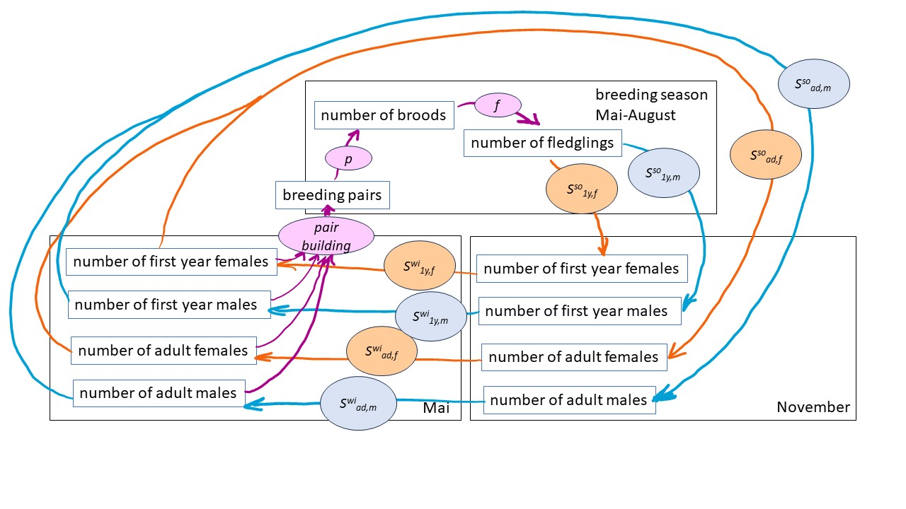
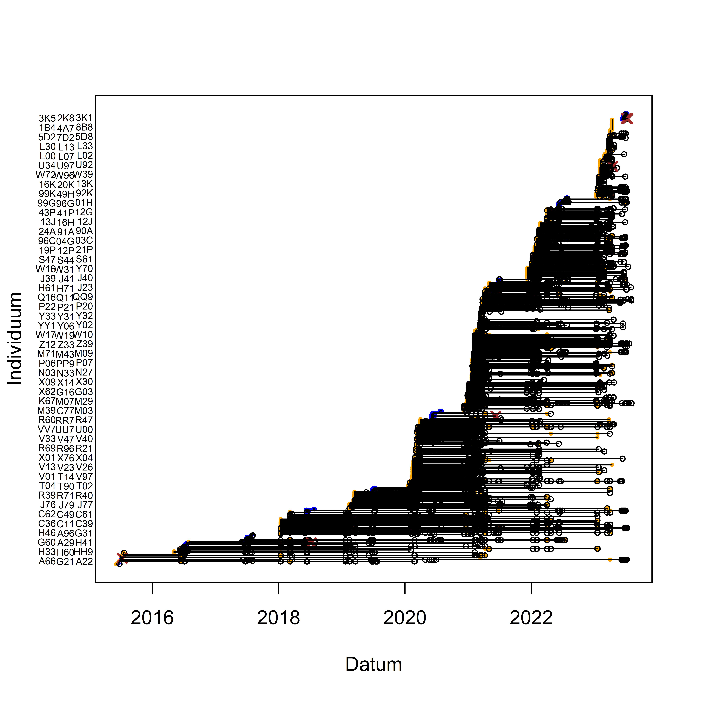

# Introduction

## Background

Global warming is changing the environment for wildlife world-wide but over proportionally in mountain areas [@Pepin.2015; @adler_cross-chapter_2022]. Exact in Alpine environments we still find specialists and endemics. To predict trends in Alpine biodiversity and for assessing the consequences of human activities for nature, the understanding of how species' population dynamics react to environmental changes is crucial. But in many cases the study of demography in species with their distribution restricted to mountain areas appears difficult because they often are rare and live in remote and inaccessible places. Therefore, such species are understudied. Any empirical data, even of low sample size, and studies on how demographic parameters and species behavior are influenced by the environment contribute to improve the understanding of how mountain specialists react to changes in the environment.  
The aim of this online material is to collate and provide demographic data together with a population model of a high-elevation specialist bird species, the White-winged Snowfinch *Montifringilla nivalis nivalis*, hereafter Snowfinch (Figure \@ref(fig:sffoto)). 

```{r sffoto, echo=FALSE, fig.cap="We use alpha-numeric plastic rings that can be read by a scope to follow individuals over their life and to study their behaviour."}

knitr::include_graphics('figures/c46.jpg')

```

The presentation of the material serves several purposes: 1) The model summarises the current knowledge on population dynamics of the Snowfinch, 2) The model can be used to assess sensitivity of the population dynamics to changes in demographic parameters. 3) The model further serves to identify knowledge gaps and lack of data, 4) The model is prepared to allow for selective mating and inheritance of individual (morphological or behavioral) traits with the aim that in future it may serve to predict how traits change in the population. To estimate microevolutionary change in specific traits, however, trait heritability values would be required to do so which are just not yet available. 5) The model allows simulation of future population trajectories to predict population trends under different scenario settings such as global warming scenario, or specific conservation managements. 

The data provided to download results from our own studies. We appreciate if you contact the authors of this material first, in case you would like to use the data for your own studies. 

We do not need to be contacted, if you download the code of the population model. Other people may have developed much nicer and more efficient model codes. But we are happy if you send us suggestions for improving our code. 

## Model structure

The model consists of a pre-winter (November) and a pre-breeding (May) census of first year and adult individuals of both sexes (Figure \@ref(fig:modelstr)). The two population census within one year allows for separately modeling environmental influences on the survival from May to November ("summer survival") and from November to May ("winter survival"). 
The model also includes a pair building process. Currently, only random mating with new pairs in each year is implemented. The parameter $p$ is a vector containing three probabilities, to skip breeding, and to do one or two broods. The three probabilities sum to one. The parameter $f$ is the number of fledglings produced by a pair. We assume a sex ratio of 1:1 among fledglings.  

```{r modelstr, echo=FALSE, fig.cap="Structure of the population model. The model contains a pair building process, e.g. random pairing. It further includes demographic parameters that may depend on environmental variables: p = probability vector for doing 0, 1 or 2 broods; f = fecundity, i.e., the number of fledglings produced by one female in one breeding season; summer and winter survival for adults and first year birds of both sexes."}



```

To parameterise the model below we present the data available so far. We also collate results from earlier studies on the relationships of demographic parameters and environmental or individual specific variables. 


# Data

```{r loadpackages, echo=FALSE, collapse=TRUE, message=FALSE}
library(birdring)
library(arm)
library(carcass)
library(R2jags)
```

## Environmental data

Empirical evidence of correlations between Snowfinch population dynamics and environmental variables is provided in the following studies:  
- Average ambient temperature during the breeding season was negatively correlated with apparent survival of female Snowfinches in the Apennines between 2003 and 2017 [@Strinella.2020].  
- Average ambient temperature during the breeding season was strongly negatively correlated with female apparent survival and moderately so in males in the Austrian Alps between 1964 and 2004 (Aichhorn in prep.).
- The timing of the broods was correlated with precipitation in early spring but did not follow the long-term advance of the snow melt in citizen science data from Switzerland from 1998 to 2019 [@Schano.2021].  
- Nestling growth rate was higher during snow melt compared to after snow melt in 87 nestlings of 24 broods in the Swiss Alps (data from 2016 to 2020) [@Ijjas.2022].  
- Temperature early in the breeding season correlated positively with the length of the breeding season (and thus, number of broods possible) and average temperature late in the breeding season correlated negatively with the length of the breeding season as inferred from citizen science of Switzerland between 1999 and 2021 (Niffenegger in prep.). 


In the current version of the population model, we relate the number of broods per female and year, and survival (first year and adult female and male survival) to temperature during the breeding season. We use average temperature values for the Swiss Alps early and late in the breeding season as predicted by the climate scenario RCP26 [@ch2018_project_team_ch2018_2018]. We use these data to have a somewhat realistic among-year variance in temperature values for simulating the population trajectories.  


```{r, fig.cap="", echo=FALSE, eval=TRUE, include=FALSE}
load("data/dwbreeding.rda")
# plot(dwbreeding$year, dwbreeding$early.tempRCP26, type="b", col="blue", lty=3, ylim=c(4,20), lwd=2)
# lines(dwbreeding$year, dwbreeding$late.tempRCP26, type="b", col="blue", lwd=2)
# lines(dwbreeding$year, dwbreeding$early.tempRCP85, type="b", col="orange", lwd=2, lty=3)
# lines(dwbreeding$year, dwbreeding$late.tempRCP85, type="b", col="orange", lwd=2)

```


## Demographic data

### Number of broods
```{r ,echo=FALSE}
load("data/broods_withknownfemales.rda")
nbroodspyear <- table(dat$femaleID, dat$year)
nsec <- apply(nbroodspyear, 2, function(x) sum(x==2))
n <- apply(nbroodspyear, 2, function(x) sum(x>0))
```

The number of broods a female raises in one year is only known for a few study sites. In the Apennines, 26 out of 26 females did a second brood [@strinella_biologia_2011]. In the Pyrenees, @grange_biologie_2008 observed that 50% of the breeding pairs did a second brood. Little is known for the Alps. @Aichhorn.1966 found in the Austrian Alps that 9 of 11 breeding pairs did a second brood. In our study in the Swiss Alps, we could detect only `r sum(nsec)` females doing a second brood out of `r sum(n)` females that were reported to breed. However, we may have missed a large part of the second broods because females may leave the study area for the second brood. 
The proportion of non-breeding females is not known at all.

To more precisely assess the proportion of females that either skip breeding, do one or two broods, it would be necessary to track females over the course of the whole breeding season. This has not been achieved yet. 

We use a hierarchical meta-analysis to combine the information from the different studies including our own. To do so, we use a binomial mixed model for the number of females that were reported to do a second brood. The study was used as a random factor to account for among-study variance. 

```{r metanrbrood, fig.cap="Reported proportion of second broods in different studies (point) with 95% uncertainty intervals. The mean (grey) is the average over all studies, taking different sample sizes into account. The sample sizes, i.e. number of females doing at least one brood, are given for each study.", echo=FALSE}
litdat <- read.table("data/demography_lit.txt", header=TRUE, sep=";")
litdat$FirstAuthor[litdat$FirstAuthor=="Grang\xe9"] <- "Grange"
index <- litdat$parameter_name=="prop_second_brood"
y <- litdat$par_value[index]
y.n <- litdat$sample_size[index]

yb <- cbind(round(y*y.n), round((1-y)*y.n))
studyID <- paste(litdat$FirstAuthor[index], litdat$Jahr[index])

yb <- rbind(yb, c(sum(nsec), sum(n)-sum(nsec)))
studyID <- c(studyID, "own data")
yb <- yb[rev(1:nrow(yb)),]
studyID <- rev(studyID)

lwr <- qbeta(p=0.025, yb[,1], yb[,2])
upr <- qbeta(p=0.975, yb[,1], yb[,2])


mod <- glmer(yb~1 +(1|studyID), family=binomial)
nsim <- 5000
bsim <- sim(mod, n.sim=nsim)
my <- plogis(mean(fixef(bsim)[,1]))
my.lwr <- plogis(quantile(fixef(bsim)[,1], probs=0.025))
my.upr <- plogis(quantile(fixef(bsim)[,1], probs=0.975))

y <- yb[,1]/apply(yb, 1, sum)

par(mar=c(5,8,1,1))
plot(y, 1:length(y), xlim=c(0,1), ylim=c(-2,length(y)+1), yaxt="n", xlab="Proportion second broods", ylab=NA, pch=16)
segments(lwr, 1:length(y), upr, 1:length(y))
axis(2, at=1:length(y), labels=studyID, las=1)
segments(my.lwr, -0.5, my.upr, -0.5, lwd=2, col="grey")
points(my, -0.5, pch=24, col="grey", bg="white")
axis(2, at=-0.5, labels="mean",
     las=1)
text(rep(0, length(y)), 1:length(y), labels=apply(yb, 1, sum))

# estimate of proportion of non-breeding females 0.1 (95% UI: 0.03 - 0.23), corresponds to SE of 0.05
p0brood <- 0.1   # proportion of non-breeding females
p0brood.se <- 0.05 # SE of proportion of non-breeding females
nsim <- 1000
p0brood.r <- rbeta(nsim, shapeparameter(p0brood, se=p0brood.se)$a, shapeparameter(p0brood, se=p0brood.se)$b)

```

The resulting average proportion of second broods has a high uncertainty. Its 95% uncertainty interval ranges from `r round(my.lwr,2)` to  `r round(my.upr,2)`, and the mean is `r round(my,2)` (Figure \@ref(fig:metanrbrood)).


For the population model, we use a proportion of non-breeding females of `r round(p0brood,2)` in average and an uncertainty interval of `r round(quantile(p0brood.r, probs=0.025),2)` to `r round(quantile(p0brood.r, probs=0.975),2)` to account for the fact that we know little about this demographic parameter. 

We derive the two intercepts of a multinomial model from the proportion of non-breeders and the proportion of females with second broods among the breeding females using Monte Carlo simulations to propagate the uncertainty. The proportions (of non-breeders, females with one and two broods) defined by the intercepts are used for average temperature values. 

```{r nrbroods_intercepts, echo=FALSE}
#  ps: an easier way would be to keep the proportion of non-breeders and the proportion of second broods among the breeders separate as two binomial models (i.e. to not combine to a multinomial model). But for now, we do a multinomial model (which turned out to be a little bit complicated, apologize for that)

# derivation of formula to calculate the intercepts
# p0brood = exp(x1)/(exp(x1) + exp(x2) + 1)
# p1brood = exp(x2)/(exp(x1) + exp(x2) + 1)
# 
# p0brood*(exp(x1) + exp(x2) + 1) = exp(x1)
# p1brood*(exp(x1) + exp(x2) + 1) = exp(x2)
# 
# p0brood*exp(x1) + p0brood*exp(x2) + p0brood = exp(x1)
# p0brood*exp(x2) + p0brood = exp(x1) - p0brood*exp(x1) = exp(x1)*(1-p0brood)
# 
# exp(x1) = (p0brood*exp(x2) + p0brood)/(1-p0brood)
# 
# p1brood*((p0brood*exp(x2) + p0brood)/(1-p0brood) + exp(x2) + 1) = exp(x2)
# 
# p1brood*(p0brood*exp(x2) + p0brood)/(1-p0brood) + p1brood*exp(x2) + p1brood = exp(x2)
# 
# (p1brood/(1-p0brood))*p0brood*exp(x2) + (p1brood/(1-p0brood))*p0brood + p1brood*exp(x2) + p1brood = exp(x2)
# 
# (p1brood*p0brood/(1-p0brood))  + p1brood = exp(x2) -(p1brood*p0brood/(1-p0brood))*exp(x2) - p1brood*exp(x2)
# 
# (p1brood*p0brood/(1-p0brood))  + p1brood = exp(x2)*(1-(p1brood*p0brood/(1-p0brood)) - p1brood)
# 
# exp(x2) = ((p1brood*p0brood/(1-p0brood))  + p1brood)/(1-(p1brood*p0brood/(1-p0brood)) - p1brood)
# exp(x1) = (p0brood*exp(x2) + p0brood)/(1-p0brood)

# specify proportion of pairs without and with only 1 brood 
# for average June and July temperature
my.se <- (my.upr-my.lwr)/4  # SE of prop second brood among breeders
my.r <- rbeta(nsim, shapeparameter(my, se=my.se)$a, shapeparameter(my, se=my.se)$b)

p1brood.r <- (1-my.r)*(1-p0brood.r)  # proportion of single brooded pairs


# derive the two intercepts of the multinomial model
x2 <- log(((p1brood.r*p0brood.r/(1-p0brood.r))  + p1brood.r)/(1-(p1brood.r*p0brood.r/(1-p0brood.r)) - p1brood.r))
x1  <- log((p0brood.r*exp(x2) + p0brood.r)/(1-p0brood.r))
x1.se <- sd(x1) 
x2.se <- sd(x2)
```

Citizen science data (ornitho.ch) from the last 20 yeara revealed that the Snowfinch breeding season started already mid May when June temperatures were high and it started mid June, when June temperatures were low (Niffenegger in prep.). Also, we saw a variation in the ending of the breeding season depending on July temperature. The warmer in July, the earlier breeding ended. Thus, both June and July temperature may finally affect the number of broods in total by one brood (for which around one month is needed) along their ranges of values. We derive effect sizes for June and July temperature that correspond to a change by one brood from the lowest to the highest temperature values. 


```{r funnrbrood, fig.cap="Proportion of females with 0, 1 or 2 broods. The 95% uncertainty intervals are indicatd with white dotted lines. They visualise the lack of knowledge on the proportion of breeders and the proportion of second broods, as well as the uncertainty in the temperature effects.", fig.asp=0.5, echo=FALSE}
# derive the effect sizes of June and July temperature
# We use 4 standard deviations as the range from low to high 
# the effect size to get 1 brood more or less in a logistic regression is around plus or minus 4 (per 4 SD of temperature values)


b1nbrood <- -1     # effect of June temperature
b1nbrood.se <- 0.3  # uncertainty (SE) for the effect of June temperature

b2nbrood <- 1   # effect of July temperature
b2nbrood.se <- 0.3 # uncertainty for the effect of July temperature

nrbroods <- function(n, env1, env2, b1=NA, b2=NA, b0=c(-2.07,-1.97)){
  # environmental variable (year-specific)
  eta1 <- b0[1] + b1*env1 + b2*env2
  eta2 <- b0[2] + b1*env1 + b2*env2
  probs <- exp(c(eta1, eta2, 0))/sum(exp(cbind(eta1, eta2, 0)))
  nb <- sample(c(0,1,2), size=n, replace=TRUE, prob=probs)
  return(list(nb=nb, probs=probs))
}


# Effect of June-temperature (env1)
env1 <- seq(-3, 3, length=100)
env2 <- 0

probssim <- array(dim=c(nsim, length(env1), 3))
for(i in 1:nsim){
  for(k in 1:length(env1)){
    x1r <- x1[i]
    x2r <- x2[i]
    b1r <- rnorm(1, b1nbrood, b1nbrood.se)
    b2r <- rnorm(1, b2nbrood, b2nbrood.se)
    probssim[i,k,] <- nrbroods(1, env1[k],env2, b1=b1r, b2=b2r,b0=c(x1r, x2r))$probs
  }
}

probscum <- probssim
probscum[,,2] <- probssim[,,1] + probssim[,,2]
probscum[,,3] <- 1

probsm <- apply(probscum, c(2,3), mean)
probslwr <- apply(probscum, c(2,3), quantile, probs=0.025)
probsupr <- apply(probscum, c(2,3), quantile, probs=0.975)

par(mfrow=c(1,2), mar=c(4,4,4,0.1))
plot(env1, probsm[,1], type="n", ylim=c(0,1), las=1, ylab="Proportion of females", xlab="June temperature")
polygon(c(env1, rev(env1)), c(rep(0, length(env1)), rev(probsm[,1])), border=NA,
        col="orange")
polygon(c(env1, rev(env1)), c(probsm[,1], rev(probsm[,2])), border=NA,
        col="brown")
polygon(c(env1, rev(env1)), c(probsm[,2], rep(1, length(env1))), border=NA,
        col="blue")
# 
 lines(env1, probslwr[,1], lty=3, col="white")
 lines(env1, probsupr[,1], lty=3, col="white")
# 
 lines(env1, probslwr[,2], lty=3, col="white")
 lines(env1, probsupr[,2], lty=3, col="white")

legend(-3, 1.25, fill=c("orange", "brown", "blue"), legend=c("no brood", "1 brood", "2 broods"), horiz=TRUE, xpd=NA, bty="n")


# Effect of July-temperature (env2)
env1 <- 0
env2 <- seq(-3, 3, length=100)

probssim <- array(dim=c(nsim, length(env2), 3))
for(i in 1:nsim){
  for(k in 1:length(env2)){
    x1r <- x1[i]
    x2r <- x2[i]
    b1r <- rnorm(1, b1nbrood, b1nbrood.se)
    b2r <- rnorm(1, b2nbrood, b2nbrood.se)
    probssim[i,k,] <- nrbroods(1, env1,env2[k], b1=b1r, b2=b2r,b0=c(x1r, x2r))$probs
  }
}

probscum <- probssim
probscum[,,2] <- probssim[,,1] + probssim[,,2]
probscum[,,3] <- 1

probsm <- apply(probscum, c(2,3), mean)
probslwr <- apply(probscum, c(2,3), quantile, probs=0.025)
probsupr <- apply(probscum, c(2,3), quantile, probs=0.975)

plot(env2, probsm[,1], type="n", ylim=c(0,1), las=1, ylab=NA, xlab="July temperature")
polygon(c(env2, rev(env2)), c(rep(0, length(env2)), rev(probsm[,1])), border=NA,
        col="orange")
polygon(c(env2, rev(env2)), c(probsm[,1], rev(probsm[,2])), border=NA,
        col="brown")
polygon(c(env2, rev(env2)), c(probsm[,2], rep(1, length(env2))), border=NA,
        col="blue")
# 
 lines(env2, probslwr[,1], lty=3, col="white")
 lines(env2, probsupr[,1], lty=3, col="white")
# 
 lines(env2, probslwr[,2], lty=3, col="white")
 lines(env2, probsupr[,2], lty=3, col="white")


```


### Number of fledglings

```{r, echo=FALSE}
index <- litdat$parameter_name== "nfledglings"
mnrfl <- litdat$par_value[index]
mnrfl.sd <- (litdat$max[index]-litdat$min[index])/4
studyID <- paste(litdat$FirstAuthor, litdat$Jahr)[index]
```

There is only one study from the Pyrenees that report the number of fledglings [@grange_biologie_2008]. They report an average of `r round(mnrfl,1)` fledglings per brood. 

```{r ldnrfeldglings, echo=FALSE}
load("data/broods.rda")

#dbroods$number.of.fledglings
index <- is.na(dbroods$number.of.fledglings)
dbroods$number.of.fledglings[index] <- dbroods$number.of.nestlings_late[index]
index <- is.na(dbroods$number.of.fledglings)
dbroods$number.of.fledglings[index] <- dbroods$number.of.nestlings_early[index]
index <- dbroods$number.of.fledglings==0; index[is.na(index)] <- FALSE
# dbroods[is.na(dbroods$number.of.fledglings),] # these are all broods not in nest boxes with no insight into the nest

dbroods <- dbroods[!is.na(dbroods$number.of.fledglings),]

# TODO:
# - change function so that stan_glmer objects can be handled, and inlcude information from literature
# - include age of mother and father
# - make number of nestlings dependent on the timing of the brood relative to snow melt rather than date

```

In our own data from Switzerland (2015-2023), we know the number of fledglings from `r nrow(dbroods)` broods. The average number of fledglings is almost 4 for broods early in the breeding season and it decreases to around 3 fledglings per brood for late broods (Fig. \@ref(fig:nrfeldglings)).

```{r nrfeldglings, echo=FALSE, fig.cap="Number of fledglings in relation to the date when the first egg of the brood hatched. The regression line is from a linear mixed model with hatching date as predictor and year as random factor. The 95% CI is given as dotted lines. Dots are slightly jittered along the y-axis."}

# date in relation to snowmelt
dbroods$doi_hatching <- dayofyear(d=dbroods$day.hatching.first.egg, 
                                  m=dbroods$month.hatching.first.egg,
                                  y=dbroods$year)
plot(jitter(number.of.fledglings)~doi_hatching, dbroods, las=1, 
     xlab="Hatching date (day of the year)", ylab="Number of fledglings", pch=16, col=rgb(0,0,0,0.5))
mod <- lmer(number.of.fledglings~doi_hatching+(1|year), data=dbroods)
abline(fixef(mod), lwd=2)
bsimfledge <- sim(mod, n.sim=nsim)
newdat <- data.frame(doi_hatching=120:220)
fitmat <- matrix(ncol=nsim, nrow=nrow(newdat))
X <- model.matrix(~doi_hatching, data=newdat)
for(i in 1:nsim) fitmat[,i] <- X%*%fixef(bsimfledge)[i,]
newdat$fit <- X%*%fixef(mod)
newdat$lwr <- apply(fitmat, 1, quantile, probs=0.025)
newdat$upr <- apply(fitmat, 1, quantile, probs=0.975)
lines(newdat$doi_hatching, newdat$lwr, lty=3)
lines(newdat$doi_hatching, newdat$upr, lty=3)

nrfledglings <- function(bsim, doi, nsim=1){
  nd <- data.frame(doi=doi)
  Xmat <- model.matrix(~doi, data=nd)
  fitmat <- matrix(ncol=nsim, nrow=nrow(nd))
  newy <- matrix(ncol=nsim, nrow=nrow(nd))
  for(i in 1:nsim){
    index <- sample(1:nrow(bsim@fixef), nsim, replace=FALSE)
    fitmat[,i] <- Xmat%*%bsim@fixef[index[i],]
    newy[,i] <- round(rnorm(nrow(nd), mean=fitmat[,i], sd=bsim@sigma[index[i]]))
    newy[,i][newy[,i]<0] <-0
  }
  return(newy)
}
#yrep <- nrfledglings(bsim=bsimfledge, doi=dbroods$doi_hatching[complete.cases(dbroods$doi_hatching)], nsim=1)
#plot(dbroods$doi_hatching[complete.cases(dbroods$doi_hatching)], yrep[,1])

# TODO: allow for among-year variance when we know more about how the role of the environment

```

For simulating the population trajectory, we draw for every brood the number of fledglings from a normal distribution around the mean number of fledglings that is defined by the hatching date and a standard deviation of `r round(summary(mod)$sigma,2)`. The standard deviation corresponds to the residual standard deviation of the regression in Figure \@ref(fig:nrfeldglings). We, for now, ignore the among-year variance because it was small in our data (SD among years: `r round(sd(ranef(mod)$year[,1]),2)`). We might allow for among-year variance once we have better data on how environmental variables influence the number of fledglings. Finally, the drawn values of the number of fledglings were rounded to the next integer in the simulations.


### Survival

#### Literature view on survival estimates for Snowfinches

There is, as far as we know, only one published study on apparent survival in Snowfinches. It is from the Appennines [@Strinella.2020]. The mark-recapture study took place between 2003 and 2017, and a couple of different mark-recapture models accounting for transients [@Pradel.1997] were used to estimate annual apparent survival. Depending on the model used, they found annual apparent survival to be between 0.51 and 0.64 for adult females, between 0.44 and 0.54 for adult males and between 0.09 and 0.13 for first year birds. In addition, they found a strong negative correlation between apparent annual survival of adult females and average temperature during the breeding season. In the Austrian Alps, Ambros Aichhorn regularly ringed Snowfinches between 1964 and 2004 in winter. Also, in these data, a strong negative correlation between temperature during the breeding season and female apparent survival is visible (own analyses in prep.). The average apparent annual survival was 0.63 (95% 0.56 -  0.70) in males and 0.50 (0.36 - 0.64) in females [@zauner_apparent_2022].

#### Own data on survival

In the project at the Swiss Ornithological Institute, we are marking individuals since May 2015 and we perform systematic searches for marked individuals. Until August 2023 we collected over 8000 resightings and over 900 recaptures (Fig. \@ref(fig:dataprepsurv)). Here, we present first, preliminary, analyses of those data and analyses results. The results are far from being perfect, but they serve to get an impression on how well we can estimate apparent survival, to identify gaps in the data and lack of knowledge, so that we can better plan our future research activities. 

```{r dataprepsurv, fig.cap="Marking- and capture/resighting data of Snowfinches in the project of the Swiss Ornithological Institute. Individuals are presented on the y-axis, the time is given on the x-axis. Dots are captures (blue as nestling, orange as fledged bird), open circles are resightings and brown crosses are findings of dead birds. Horizontal lines connect recaptures, resightings or findings of the same individual.", echo=FALSE}
load("data/datax.rda")



```

We used alpha-numeric plastic rings to enable resightings of birds. Likely due to the cold in winter, the plastic rings break and get lost after some months. Birds without plastic rings only can get recaptured but no longer resighted. To account for that loss of plastic rings, we usesd a multi-state/multi-event model [@Arnason.1972, @pradel_multievent_2005] adapted so that it accounts for loss of plastic rings [@laake_hidden_2014]. We divided the study period into 3-months intervals and collated the capture-recapture/resightings into an observation history matrix with a row per individual and plastic ring respectively. When an individual that has lost its plastic ring got a new plastic ring on a recapture, we defined that recapture to be a new release, i.e. we added a new observation history to the data matrix. Following @laake_hidden_2014, we defined that the birds can be in 3 different states: 1=alive with metallic and plastic ring, 2=alive with metallic ring only, 3= dead. Transitions between states $T$ were defined by apparent survival probability $\phi$ and the probability to lose a plastic ring $m$.  

\[T = 
  \left[ {\begin{array}{ccc}
    (1-m)\phi_{i,t} & m\phi_{i,t} & 1-\phi_{i,t} \\
    0 & \phi_{i,t} & 1-\phi_{i,t}\\
    0 & 0 &  1\\
  \end{array} } \right]
\]

Observation events are 1=individual is recorded wearing its plastic ring (resightings and recaptures), 2=individual is recorded without plastic ring (e.g. a recapture), 3=individual has not been seen or recaptured during the 3-months interval. We defined two different probabilities to record an individual during a 3-months interval, one for individuals having a plastic ring $p^*$ and one for individuals without a plastic ring $p$. Depending on the state of the individuals, they can be recorded according to the observation matrix: 

\[O = 
  \left[ {\begin{array}{ccc}
    p^* & 0 & 1-p^* \\
    0 & p & 1-p\\
    0 & 0 &  1\\
  \end{array} } \right]
\]

Apparent survival and recapture/resighting probabilities were estimated independently for each age class (first half year vs. older than half a year), sex and season. We assume that ring loss probability is constant. 

The preliminary results presented here, need to be handled with care because important relevant structures are still missing from the model. For example:  

- Probability that a plastic ring is lost varies among ring series. A random factor for the ring series could be added as predictor for re-sighting probability $p^*$.  

- Many individuals are first captured in winter which makes it likely that our data contains a high amount of so-called transients, i.e. individuals that are marked and then move away from our study site. It could be accounted for such transients in the model.  

- Among-year variance in apparent survival is not yet included in the model.  

- Among-individual variance in either apparent survival or in recapture/resighting probability other than age and sex is not yet included in the model.  

- First year birds are only treated as first year birds until December. Later, it is assumed that apparent survival of these birds is equal to adults (see below).  

- Resightings made outside our study area (currently 25 cases) could be used to model movements and, consequently, we could get closer to true instead of apparent survival. 


We are happy to hear of further thoughts and ideas on how to improve the survival estimation. 

We fitted the model using Markov chain Monte Carlo simulations as implemented in Jags [@Plummer2003]. The Jags code is provided in the code repository of this Github project. 


```{r survest, fig.cap="Three-months apparent survival estimates for juvenile (first half year) and adult Snowfinches in the Swiss Alps. Vertical bars are 95% intervals of the posterior distributions.", echo=FALSE}
initfun <- function(){
  list(a0=array(runif(2*2*3, 0,1), dim=c(2,2,3)),
       b0=array(runif(2*2*3, 0,1), dim=c(2,2,3)),
       d0=array(runif(2*2*3, 0,1), dim=c(2,2,3)))
}

# mod <- jags(datax, inits=initfun, 
#             parameters.to.save=c("a0", "b0", "d0", "m", "pfem"),
#             model.file="jags/survmod_bird_and_ring.txt", n.iter=5000, n.chains=3)
# mod1 <- mod$BUGSoutput
load("modelfits/mod_231011.rda")

#traceplot(mod1)

plot(1:4, seq(0,1, length=4), type="n", las=1,
     ylab="3-months apparent survival", xlab=NA, xaxt="n",
     xlim=c(0.5, 4.5))
axis(1, at=1:4, labels=c("J-M to A-J", "A-J to J-S", "J-S to O-D", "O-D to J-M"),
     cex.axis=0.7)
axis(1, at=1:4, labels=c("late\nwinter", "breeding", 
                         "late\nsummer", "early\nwinter"), mgp=c(3,3,0))
# adult females
segments(c(1:4), plogis(apply(mod1$sims.list$b0[,1,2,], 2, quantile, probs=0.025)),
         c(1:4), plogis(apply(mod1$sims.list$b0[,1,2,], 2, quantile, probs=0.975)), col="orange", lwd=2)
points(c(1:4), plogis(apply(mod1$sims.list$b0[,1,2,], 2, mean)), pch=21, bg="white", col="orange")         

# adult males
segments(c(1:4)+0.2, plogis(apply(mod1$sims.list$b0[,2,2,], 2, quantile, probs=0.025)),
         c(1:4)+0.2, plogis(apply(mod1$sims.list$b0[,2,2,], 2, quantile, probs=0.975)), col="blue", lwd=2)
points(c(1:4)+0.2, plogis(apply(mod1$sims.list$b0[,2,2,], 2, mean)), pch=21, bg="white", col="blue")         

# juvenile females
segments(c(2:3)-0.3, plogis(apply(mod1$sims.list$b0[,1,1,2:3], 2, quantile, probs=0.025)),
         c(2:3)-0.3, plogis(apply(mod1$sims.list$b0[,1,1,2:3], 2, quantile, probs=0.975)), col="yellow4", lwd=2)
points(c(2:3)-0.3, plogis(apply(mod1$sims.list$b0[,1,1,2:3], 2, mean)), pch=22, bg="white", col="yellow4")         

# juvenile males
segments(c(2:3)-0.15, plogis(apply(mod1$sims.list$b0[,2,1,2:3], 2, quantile, probs=0.025)),
         c(2:3)-0.15, plogis(apply(mod1$sims.list$b0[,2,1,2:3], 2, quantile, probs=0.975)), col="lightblue", lwd=2)
points(c(2:3)-0.15, plogis(apply(mod1$sims.list$b0[,2,1,2:3], 2, mean)), pch=22, bg="white", col="lightblue")         

legend(3.1, 0.6, lwd=2, col=c("yellow4", "lightblue", "orange", "blue"),
       pch=c(22, 22, 21, 21), bg="white", legend=c("juvenile females", "juvenile males", "adult female", "adult male"),
       bty="n", cex=0.8)


```

Our preliminary results indicate that adult apparent survival is lowest in late winter. Survival may be lower in females compared to males in late summer. Apparent survival of the freshly fledged birds in late summer may be underestimated because we assume that during the second half of their first year, their apparent survival equals adult apparent survival, which may not be true. However, after the post-juvenile moult in late summer, first year and older birds are no longer distinguishable. Therefore, we only know of birds captured for the first time in winter, that they are at least half a year old. To be able to separately estimate first year apparent survival for the whole first year, we would need to deal with unidentified ages. 

```{r, echo=FALSE}
# annual survival
annSad <- apply(plogis(mod1$sims.list$b0[,,2,]), c(1:2), prod)
Sadwinter <- apply(plogis(mod1$sims.list$b0[,,2,c(1,4)]), c(1:2), prod)
Sadsummer <- apply(plogis(mod1$sims.list$b0[,,2,c(2,3)]), c(1:2), prod)

# first year survival (first year survival during breeding may not be estimable, use adult survival instead):
annSfirst <- plogis(mod1$sims.list$b0[,,1,3])*plogis(mod1$sims.list$b0)[,,2,4]*plogis(mod1$sims.list$b0)[,,2,1]*plogis(mod1$sims.list$b0)[,,2,2]

Sfirstwinter <- Sadwinter 
Sfirstsummer <- plogis(mod1$sims.list$b0[,,1,3])
```

From our preliminary model, we get an annual apparent survival estimate for adult females of `r round(median(annSad[,1]),2)` (95% CrI: `r round(quantile(annSad[,1], prob=0.025),2)` - `r round(quantile(annSad[,1], prob=0.975),2)`), for adult males `r round(median(annSad[,2]),2)` (`r round(quantile(annSad[,2], prob=0.025),2)` - `r round(quantile(annSad[,2], prob=0.975),2)`), and of first year females `r round(median(annSfirst[,1]),2)` (`r round(quantile(annSfirst[,1], prob=0.025),2)` - `r round(quantile(annSfirst[,1], prob=0.975),2)`), and for first year males `r round(median(annSfirst[,2]),2)` (`r round(quantile(annSfirst[,2], prob=0.025),2)` - `r round(quantile(annSfirst[,2], prob=0.975),2)`).

Table: Half-year apparent survival estimates (preliminary results). Note, winter apparent survival of first years is assumed to be equal to adult apparent survival. 

| Age |  Sex | Apparent survival May - Nov | Apparent survival Nov - May| 
|:---|---:|----:|----:|
|first year | female | `r round(median(Sfirstsummer[,1]),2)` (`r round(quantile(Sfirstsummer[,1], prob=0.025),2)` - `r round(quantile(Sfirstsummer[,1], prob=0.975),2)`) | `r round(median(Sfirstwinter[,1]),2)` (`r round(quantile(Sfirstwinter[,1], prob=0.025),2)` - `r round(quantile(Sfirstwinter[,1], prob=0.975),2)`)|
|first year | male |  `r round(median(Sfirstsummer[,2]),2)` (`r round(quantile(Sfirstsummer[,2], prob=0.025),2)` - `r round(quantile(Sfirstsummer[,2], prob=0.975),2)`)| `r round(median(Sfirstwinter[,2]),2)` (`r round(quantile(Sfirstwinter[,2], prob=0.025),2)` - `r round(quantile(Sfirstwinter[,2], prob=0.975),2)`)|
|adult| female |  `r round(median(Sadsummer[,1]),2)` (`r round(quantile(Sadsummer[,1], prob=0.025),2)` - `r round(quantile(Sadsummer[,1], prob=0.975),2)`) |`r round(median(Sadwinter[,1]),2)` (`r round(quantile(Sadwinter[,1], prob=0.025),2)` - `r round(quantile(Sadwinter[,1], prob=0.975),2)`) |
|adult | male | `r round(median(Sadsummer[,2]),2)` (`r round(quantile(Sadsummer[,2], prob=0.025),2)` - `r round(quantile(Sadsummer[,2], prob=0.975),2)`)  | `r round(median(Sadwinter[,2]),2)` (`r round(quantile(Sadwinter[,2], prob=0.025),2)` - `r round(quantile(Sadwinter[,2], prob=0.975),2)`) |

The probability that a plastic ring is lost within three months is `r round(mod1$mean$m, 3)` (`r round(quantile(mod1$sims.list$m, probs=0.025),3)` - `r round(quantile(mod1$sims.list$m, probs=0.975),3)`), which means that one year after having got a plastic ring, `r round(1-(1-mod1$mean$m)^4,2)`% of the individuals have lost their ring. 

#### Survival function of the predictive population model

From the survival analyses that are available up to now, we collated a survival function that produces a survival probability for summer and winter for each age and sex class dependent on a standardised environmental variable (Fig. \@ref(fig:survivalfunctions)). Intercepts are taken from the analyses of our own data (presented above) and effect of the environmental variables are taken from the long-term data from Austria [@zauner_apparent_2022]. For every run of the population model, we draw a random intercept and slope for each age and sex class and we keep these values for the whole population trajectory. In this way, the uncertainty of survival propagates into the uncertainty of the population trajectory. 


```{r survivalfunctions, fig.cap="Survival function used in the predictive population model.", echo=FALSE, fig.asp=0.45}

# increase estimated apparent survival of first year by 10% to account for dispersal/transients
dispfactor <- 1.1

# survival from Mai to November
Ssummervalues <- cbind(Sfirstsummer*dispfactor, Sadsummer) # fy F, fy M, ad F, ad M
Ssummervalues[Ssummervalues>1] <- 1

Ssummer <- function(age, sex, env=0, b=c(-0.5/2,-0.5/2, -0.95/2, -0.28/2), sprob=sprobsummer){
  agefac <- factor(age, levels=c("fy", "ad"))
  sexfac <- factor(sex, levels=c("F", "M"))
  index <- (as.numeric(agefac)-1)*2 + as.numeric(sexfac)
  sprobv <- plogis(qlogis(sprob[index]) + b[index]*env)
  alive <- rbinom(length(sex), size=1, prob=sprobv)
  return(list(sprob=sprobv, alive=alive))
} 

Swintervalues <- cbind(Sfirstwinter*dispfactor, Sadwinter) # fy F, fy M, ad F, ad M
Swintervalues[Swintervalues>1] <- 1

Swinter <- function(age, sex, env=0, b=c(-0.5/2,-0.5/2, -0.95/2, -0.28/2), sprob=sprobwinter){
  agefac <- factor(age, levels=c("fy", "ad"))
  sexfac <- factor(sex, levels=c("F", "M"))
  index <- (as.numeric(agefac)-1)*2 + as.numeric(sexfac)
  sprobv <- plogis(qlogis(sprob[index]) + b[index]*env)
  alive <- rbinom(length(sex), size=1, prob=sprobv)
  return(list(sprob=sprobv, alive=alive))
} 


envx <- seq(-3, 3, length=100)
newdat <- expand.grid(sex=c("F", "M"), age=c("fy", "ad"), env=envx)
fitmatsu <- matrix(ncol=nrow(Ssummervalues), nrow=nrow(newdat))
fitmatwi <- matrix(ncol=nrow(Ssummervalues), nrow=nrow(newdat))
# According to Aichhorn temp-effect: adult F -0.95, M -0.28 with SE 0.42, 0.21

for(i in 1:nrow(Ssummervalues)){
  benvsu <- rnorm(4, c(-0.5/2,-0.5/2, -0.95/2, -0.28/2), sd=c(0.3/2, 0.3/2, 0.42/2, 0.21/2))
  benvwi <- rnorm(4, c(-0.5/2,-0.5/2, -0.95/2, -0.28/2), sd=c(0.3/2, 0.3/2, 0.42/2, 0.21/2))
  fitmatsu[,i] <- Ssummer(age=newdat$age, sex=newdat$sex, env=newdat$env, b=benvsu, sprob=Ssummervalues[i,])$sprob
  fitmatwi[,i] <- Swinter(age=newdat$age, sex=newdat$sex, env=newdat$env, b=benvwi, sprob=Swintervalues[i,])$sprob
}

newdat$Ssummer.fit <- apply(fitmatsu, 1, median)
newdat$Ssummer.lwr <- apply(fitmatsu, 1, quantile, probs=0.025)
newdat$Ssummer.upr <- apply(fitmatsu, 1, quantile, probs=0.975)

newdat$Swinter.fit <- apply(fitmatwi, 1, median)
newdat$Swinter.lwr <- apply(fitmatwi, 1, quantile, probs=0.025)
newdat$Swinter.upr <- apply(fitmatwi, 1, quantile, probs=0.975)

newdat$S.fit <- apply(fitmatsu*fitmatwi, 1, median)
newdat$S.lwr <- apply(fitmatsu*fitmatwi, 1, quantile, probs=0.025)
newdat$S.upr <- apply(fitmatsu*fitmatwi, 1, quantile, probs=0.975)

par(mfrow=c(1,3), mar=c(4,1,3,1), oma=c(0,4,0,0))
plot(newdat$env, newdat$Ssummer.fit, type="n", xlab="Environmental variable", las=1, ylab=NA, main="Summer survival", ylim=c(0,1))
index <- newdat$sex=="F" & newdat$age=="fy"
polygon(c(newdat$env[index], rev(newdat$env[index])),
        c(newdat$Ssummer.lwr[index], rev(newdat$Ssummer.upr[index])), border=NA, col=rgb(0.5,0,0,0.5))
lines(newdat$env[index], newdat$Ssummer.fit[index], col=rgb(0.5,0,0), lwd=2)

index <- newdat$sex=="M" & newdat$age=="fy"
polygon(c(newdat$env[index], rev(newdat$env[index])),
        c(newdat$Ssummer.lwr[index], rev(newdat$Ssummer.upr[index])), border=NA, col=rgb(0,0,0.5,0.5))
lines(newdat$env[index], newdat$Ssummer.fit[index], col=rgb(0,0,0.5), lwd=2)

index <- newdat$sex=="F" & newdat$age=="ad"
polygon(c(newdat$env[index], rev(newdat$env[index])),
        c(newdat$Ssummer.lwr[index], rev(newdat$Ssummer.upr[index])), border=NA, col=rgb(1,0,0,0.5))
lines(newdat$env[index], newdat$Ssummer.fit[index], col=rgb(1,0,0), lwd=2)

index <- newdat$sex=="M" & newdat$age=="ad"
polygon(c(newdat$env[index], rev(newdat$env[index])),
        c(newdat$Ssummer.lwr[index], rev(newdat$Ssummer.upr[index])), border=NA, col=rgb(0,0,1,0.5))
lines(newdat$env[index], newdat$Ssummer.fit[index], col=rgb(0,0,1), lwd=2)

# winter survival
plot(newdat$env, newdat$S.fit, type="n", xlab="Environmental variable", las=1, ylab=NA, main="Winter survival", ylim=c(0,1))
index <- newdat$sex=="F" & newdat$age=="fy"
polygon(c(newdat$env[index], rev(newdat$env[index])),
        c(newdat$Swinter.lwr[index], rev(newdat$Swinter.upr[index])), border=NA, col=rgb(0.5,0,0,0.5))
lines(newdat$env[index], newdat$Swinter.fit[index], col=rgb(0.5,0,0), lwd=2)

index <- newdat$sex=="M" & newdat$age=="fy"
polygon(c(newdat$env[index], rev(newdat$env[index])),
        c(newdat$Swinter.lwr[index], rev(newdat$Swinter.upr[index])), border=NA, col=rgb(0,0,0.5,0.5))
lines(newdat$env[index], newdat$Swinter.fit[index], col=rgb(0,0,0.5), lwd=2)

index <- newdat$sex=="F" & newdat$age=="ad"
polygon(c(newdat$env[index], rev(newdat$env[index])),
        c(newdat$Swinter.lwr[index], rev(newdat$Swinter.upr[index])), border=NA, col=rgb(1,0,0,0.5))
lines(newdat$env[index], newdat$Swinter.fit[index], col=rgb(1,0,0), lwd=2)

index <- newdat$sex=="M" & newdat$age=="ad"
polygon(c(newdat$env[index], rev(newdat$env[index])),
        c(newdat$Swinter.lwr[index], rev(newdat$Swinter.upr[index])), border=NA, col=rgb(0,0,1,0.5))
lines(newdat$env[index], newdat$Swinter.fit[index], col=rgb(0,0,1), lwd=2)

# annual
plot(newdat$env, newdat$S.fit, type="n", xlab="Environmental variable", las=1, ylab=NA, main="Annual survival", ylim=c(0,1))
index <- newdat$sex=="F" & newdat$age=="fy"
polygon(c(newdat$env[index], rev(newdat$env[index])),
        c(newdat$S.lwr[index], rev(newdat$S.upr[index])), border=NA, col=rgb(0.5,0,0,0.5))
lines(newdat$env[index], newdat$S.fit[index], col=rgb(0.5,0,0), lwd=2)

index <- newdat$sex=="M" & newdat$age=="fy"
polygon(c(newdat$env[index], rev(newdat$env[index])),
        c(newdat$S.lwr[index], rev(newdat$S.upr[index])), border=NA, col=rgb(0,0,0.5,0.5))
lines(newdat$env[index], newdat$S.fit[index], col=rgb(0,0,0.5), lwd=2)

index <- newdat$sex=="F" & newdat$age=="ad"
polygon(c(newdat$env[index], rev(newdat$env[index])),
        c(newdat$S.lwr[index], rev(newdat$S.upr[index])), border=NA, col=rgb(1,0,0,0.5))
lines(newdat$env[index], newdat$S.fit[index], col=rgb(1,0,0), lwd=2)

index <- newdat$sex=="M" & newdat$age=="ad"
polygon(c(newdat$env[index], rev(newdat$env[index])),
        c(newdat$S.lwr[index], rev(newdat$S.upr[index])), border=NA, col=rgb(0,0,1,0.5))
lines(newdat$env[index], newdat$S.fit[index], col=rgb(0,0,1), lwd=2)

legend(-0.7,1, lwd=2, col=c(rgb(0.5,0,0), rgb(0,0,0.5), rgb(1,0,0), rgb(0,0,1)), legend=c("First year female", "First year male", "Adult female", "Adult male"), bty="n")

mtext("Survival probability", side=2, outer=TRUE, line=2)
```


# Population model

## Starting population

We start with a population of 7000 individuals just before the breeding season (pre-breeding census) consisting of 1000 adult females, 1000 adult males and each 2500 first year males and females. The age composition corresponds to a stable age structure of a population with a fecundity of 2.5, first year survival of 0.2 and adult survival of 0.5. 


```{r preparepop, collapse=TRUE, echo=FALSE}
# stable age structure in a population with adult survival =0.5, juv survival =0.2, f=6/2
leslie <- matrix(c(2.5*0.2,2.5*0.5,
                   0.2, 0.5), nrow=2, ncol=2, byrow=TRUE)
#max(Re(eigen(leslie)$values)) # growth rate
z <- which(Re(eigen(leslie)$values)==max(Re(eigen(leslie)$values))) 
revec <- Re(eigen(leslie)$vectors[,z])
agestruc <- revec/sum(revec) # age structure

N0adF <- 1000 # number of adult females at start
N0adM <- 1000 # number of adult males at start
N0fyF <- round(N0adF/agestruc[2]*agestruc[1]) # number of first year females at start
N0fyM <- round(N0adM/agestruc[2]*agestruc[1])  # number of first year males at start

nyears <- nrow(dwbreeding) # number of years the population trajectory runs

# individual specific characteristics
xm <- 0
xsd <- 1

# create the starting ring list with attributes per individual

dindinit <- data.frame(ringnr=1:(N0adF+N0adM+N0fyF+N0fyM),
                   sex=c(rep("F", N0adF), rep("M", N0adM), rep("F", N0fyF), rep("M", N0fyM)),
                   age=c(rep("ad", times=N0adF+N0adM), rep("fy", time=N0fyF+N0fyM)))

dindinit$x <- rnorm(nrow(dindinit), xm, xsd)


# create environmental variables
dyear <- data.frame(year=1:nyears)

dyear$x1 <- as.numeric(scale(dwbreeding$early.tempRCP26))
dyear$x2 <-  as.numeric(scale(dwbreeding$late.tempRCP26))
dyear$summertemp <- (dyear$x2 + dyear$x2)/2
dyear$summertemp.z <- as.numeric(scale(dyear$summertemp))

# number of Monte Carlo simulations
nsim <- 100


```


## Run population trajectory

To simulate the population trajectory, we follow the structure presented in Figure \@ref(fig:modelstr). The steps are the following:  

1. Build breeding pairs: With the females and  males present in the population, the breeding pairs are formed. The number of brereding pairs corresponds to the minimum of the number of males and females.  

2. The number of broods per breeding pair is simulated based on the temperature early and late in the breeding season according to Figure \@ref(fig:funnrbrood). At this step, a certain proportion of pairs are assigned to be non-breeders (number of broods is zero).    

3. Number of fledglings per brood is simulated based on the date of the brood (Figure \@ref(fig:nrfeldglings)). To keep the model simple for the moment, we assume that the first broods hatch at day 162 and the second broods at day 190.

4. Summer and winter survival is simulated for each individual assuming a survival probability defined by the functions visualised in Figure \@ref(fig:survivalfunctions). We use the average temperature during breeding season (average over early and late) as predictor for survival.  

5. The simulation proceeds wit step 1. with the individuals that survived until the beginning of the following breeding season.  


```{r populationfun, echo=FALSE}

runpopmod <- function(nyears, dind, dyear,
                      nrbr.b0, nrbr.b1, nrbr.b2,
                      sprobwinter, sprobsummer, benvwi, benvsu,
                      bsimnfl=bsimfledge){
  
# to monitor
popsize <- numeric(nyears)
meanx <- numeric(nyears) # individual characteristic
sdx <- numeric(nyears)   # sd of individual characteristic
asr <- numeric(nyears) # adult sex ratio

# set first population size to size of initial population
popsize[1] <- sum(dind$sex=="F")
asr[1] <- sum(dind$sex=="F")/sum(dind$sex=="M")
  

for(t in 2:nyears){
  
  # breeding pairs
  dfemales <- dind[dind$sex=="F",]
  dmales <- dind[dind$sex=="M",]
  if(nrow(dfemales)>0&nrow(dmales)>0){
    npsex <- table(dind$sex)
    dfemales$male <- NA
    dfemales$male[1:min(npsex)] <- sample(dmales$ringnr, min(npsex), replace=FALSE)
    dfemales$male.age <- dmales$age[match(dfemales$male, dmales$ringnr)]
    #cat("sim", i, "t", t, "breeding pairs assigned\n")
  
    # number of broods per breeding pairs
    dfemales$nrbroods <- nrbroods(n=nrow(dfemales), 
                                  env1=dyear$x1[t-1],
                                  env2=dyear$x2[t-1],
                                  b0=nrbr.b0,
                                  b1=nrbr.b1, 
                                  b2=nrbr.b2)$nb
    nomate <- is.na(dfemales$male)
    dfemales$nrbroods[nomate] <- 0
    # muss 3 proportions enthalten per breeding pair according to results of Carole
  #cat("nr broods finished\n")
  
    # number of fledglings per breeding pair
      dfemales$doi_hatching_firstbrood <- 162
      dfemales$nfledfirstbrood <- nrfledglings(bsim=bsimnfl, doi=dfemales$doi_hatching_firstbrood, nsim=1)
    
      dfemales$nfledsecondbrood <- nrfledglings(bsim=bsimnfl, doi=dfemales$doi_hatching_firstbrood+28, nsim=1)
      dfemales$nfledfirstbrood[nomate] <- 0
      dfemales$nfledsecondbrood[nomate] <- 0
    
      dfemales$nfledlings <- dfemales$nfledfirstbrood*as.numeric(dfemales$nrbroods>0) + dfemales$nfledsecondbrood*as.numeric(dfemales$nrbroods==2)
    #cat("nr fledglings drawn\n")
  
   # create data with juveniles including individual characteristics
    if(sum(dfemales$nfledlings)>0){
     dindjuv <- data.frame(ringnr=(max(dind$ringnr)+1):(max(dind$ringnr)+sum(dfemales$nfledlings)),
                        mother=rep(dfemales$ringnr, times=dfemales$nfledlings),
                        father=rep(dfemales$male, times=dfemales$nfledlings))
     dindjuv$sex <- sample(c("F", "M"), nrow(dindjuv), replace=TRUE, prob=c(0.5,0.5)) # primary sex ratio
     dindjuv$xmother <- dind$x[match(dindjuv$mother, dind$ringnr)]
     dindjuv$xfather <- dind$x[match(dindjuv$father, dind$ringnr)]
     # inheriting characteristics
     dindjuv$x <- sqrt(0.6/2)*dindjuv$xmother + sqrt(0.6/2)*dindjuv$xfather + rnorm(nrow(dindjuv), 0, sd=sqrt(0.4)) # 60% heritability
     #cat("dindjuv created with nr juvs=", nrow(dindjuv), "\n")


    
    # Population at the end of the breeding season
     dtemp <- data.frame(ringnr=c(dind$ringnr, dindjuv$ringnr),
                      sex=c(dind$sex, dindjuv$sex),
                      age=c(rep("ad", nrow(dind)), rep("fy", nrow(dindjuv))),
                      x=c(dind$x, dindjuv$x))
    } # close if (zero number of juveniles)
    if(sum(dfemales$nfledlings)==0) dtemp <- dind
      
     # Survival from breeding season to winter
     dtemp$alive <- Ssummer(dtemp$age, dtemp$sex, b=benvsu, sprob=sprobsummer)$alive
     dtemp <- dtemp[dtemp$alive==1,]
     
     # Survival from winter to breeding
     if(nrow(dtemp)>0){
    dtemp$alive <- Swinter(dtemp$age, dtemp$sex, b=benvwi, sprob=sprobwinter)$alive
    dtemp <- dtemp[dtemp$alive==1,]
    } # close if (at least one juvenile)
      
    # Population at the beginning of the breeding season  
    dind <- dtemp
  
    popsize[t] <- sum(dind$sex=="F")
    meanx[t] <- mean(dind$x)
    sdx[t] <- sd(dind$x)
    asr[t] <- sum(dind$sex=="F")/sum(dind$sex=="M")

  } # close if
  if(nrow(dfemales)==0|nrow(dmales)==0) popsize[t] <- 0
  if(nrow(dfemales)==0|nrow(dmales)==0)  break
} # close t
return(list(popsize=popsize,
            meanx=meanx,
            sdy=sdx,
            asr=asr))
} # close function runpopmod

```


```{r runsim, message=FALSE, eval=FALSE, echo=FALSE}
nsim <- 1000
set.seed(20359)
popsizes <- matrix(ncol=nyears, nrow=nsim)

for(i in 1:nsim) {
# draw parameters that do not change over years

#nrbroods
nrbr.b0i <- numeric(2)
nrbr.b0i[1] <- sample(x1, 1) 
nrbr.b0i[2] <- sample(x2, 1)
nrbr.b0i <- sort(nrbr.b0i)
nrbr.b1i <- rnorm(1, b1nbrood, sd=b1nbrood.se)
nrbr.b2i <- rnorm(1, b2nbrood, sd=b2nbrood.se)
  
## survival
kk <- sample(1:nrow(Ssummervalues), 1)
sprobwinteri <- Swintervalues[kk, ]
sprobsummeri <- Ssummervalues[kk, ]
benvsui <- rnorm(4, c(-0.5/2,-0.5/2, -0.95/2, -0.28/2), sd=c(0.3/2, 0.3/2, 0.21/2, 0.42/2))
benvwii <- rnorm(4, c(-0.5/2,-0.5/2, -0.95/2, -0.28/2), sd=c(0.3/2, 0.3/2, 0.21/2, 0.42/2))
 
popsizes[i,] <- runpopmod(nyears=nyears, dind=dindinit,
                          dyear=dyear, nrbr.b0=nrbr.b0i, 
                          nrbr.b1=nrbr.b1i, nrbr.b2=nrbr.b2i,
                          sprobwinter=sprobwinteri, sprobsummer=sprobsummeri, benvsu=benvsui, benvwi=benvwii)$popsize
}
save(popsizes, file="modelfits/popsizes.rda")
```


## Predicted population trajectories


```{r, echo=FALSE}
load("modelfits/popsizes.rda")

popsizes_mean <- apply(popsizes, 2, median)
popsizes_lwr <- apply(popsizes, 2, quantile, prob=0.05)
popsizes_upr <- apply(popsizes, 2, quantile, prob=0.95)

trendfun <- function(x) exp(coef(lm(log(x)~c(1:length(x))))[2])
trend_currentknowledge <- apply(popsizes, 1, trendfun)
```


With the above collated information on the number of broods per female and year, the number of fledglings per brood and survival we predict that a population of 3500 females decreases in average to around 1000 within 10 years (Figure \@ref(fig:vispopcurrentknow)). The population trend is `r round(quantile(trend_currentknowledge, probs=0.5),2)` (95% CI: `r round(quantile(trend_currentknowledge, probs=0.025),2)` - `r round(quantile(trend_currentknowledge, probs=0.975),2)`).  


Before the population trajectory can be used as a prediction of the future of Snowfinch populations several points need to be improved in the population model, for example:  

- As average survival we used the estimates for apparent survival instead of true survival. Apparent survival normally is lower than true survival because it is the product of fidelity to the study area and survival. Therefore, our model may use too low survival probabilities. To get estimates for true survival we could either account for emigration in the survival model (see above) or we could gradually increase the survival estimates in the population model until the resulting trend corresponds to the observed population trend in Switzerland (https://www.vogelwarte.ch/de/voegel-der-schweiz/schneesperling/).  

- The (standardised) temperature values we now used to simulate among-year variance in the number of broods and survival would be needed to be measured relative to the temperature when the demographic parameters were measured. The current model assumes that the average temperature in the 10 virtual "future" years is the same as it was when the demographic parameters were measured.   

- We assumed that in average (i.e. for average temperature values) the proportion of non-breeders is 10%, and that this proportion increases or decreases depending on the length of the breeding season that is defined by temperature early and late in the breeding season. The value of 10% is nothing else than a gut-feeling, no data is yet available. We are currently using data loggers to collect exactly that data. Alternatively, we could use our model to reconstruct the population trend since 1990 and vary the proportion of non-breeders until the trend correspond to the observed one (https://www.vogelwarte.ch/de/voegel-der-schweiz/schneesperling/). This alternative is possible as soon as we have empirical estimates of true survival.  

- For sure, there are further points to be considered.   


```{r vispopcurrentknow, fig.cap="90% range of simulated population trajectories based on current knowledge on demographic parameters.", echo=FALSE}
plot(1:nyears, seq(0,quantile(popsizes[,1:10], prob=0.97), length=nyears), type="n", xlab="Year", ylab="Population size (nr females)", las=1, xlim=c(1,10))
polygon(c(1:nyears, rev(1:nyears)), 
        c(popsizes_lwr, rev(popsizes_upr)), border=NA,
        col=rgb(1,0.8,0.2,0.5))
lines(1:nyears, popsizes_mean, lwd=2, col="brown")
#for(i in 1:nsim) lines(1:nyears, popsizes[i,], col=rgb(0,0,0,0.3))

```


## Sensitivity of the population model to changes in different parameters

To assess how sensitive the population trend $\lambda$ is to changes of specific parameter values, we used a deterministic matrix model to calculate the population growth rate as the dominant eigenvalue of the Lefkovitch matrix [@Caswell.2001; @Pastor.2008]. We varied one of demographic parameter at a time, while we kept all other parameters at their average values used for the simulation above. We only considered the females for this sensitivity analysis, and we calculated fecundity, i.e. the average number of females produced by a female, as $(1-P(non-breeder))*(f_{1st brood} + P(2nd brood)*f_{2nd brood})/2$, where $P(non-breeder)$ is the proportion of non-breeders, $f_{1st brood}$ and $f_{2nd brood}$ the number of fledglings in the first and second brood and $P(2nd brood)$ the proportion of females doing a second brood among the breeding females. We assume a sex ratio of 1:1 among the fledglings as we also do in the stochastic population model (simulation above). 

Even though the units with which the different demographic parameters are measured are not directly comparable, we may conclude that small changes in survival, particularly juvenile survival have a strong effect on population growth rate, whereas a change in the average number of nestlings only has a small effect on the population growth rate (Figure \@ref(fig:sensan)). The proportion of non-breeders has a larger effect on the population growth (per unit change) compared to the proportion of second broods. However, we think the variance, and consequently the range of plausible average values, in the proportion of non-breeding females may be lower than in the proportion of second broods among the breeding females. 

From these results, we conclude that for a prediction of future population trends, it is most important to have a solid understanding of how survival is related to environmental variables. Further, it is more important to know the proportion of non-breeders and the proportion of second broods compared to the average number of fledglings. 

```{r sensan, echo=FALSE, fig.cap="Sensitivity of the population growth rate to changes in single demographic parameters inferred from a deterministic matrix model. Only one parameter is changed at a time whereas all others were kept at the values used for the simulation. The scales of the x-axes are chosen so that they span the range of plausible average values. The grey horizontal line indicates the population trend for average parameter values."}
# p0brood: proportion of non-breeders among females
# my proportion of second broods among breeding females
nrfledglings1stbr <- fixef(mod)[1] + 162*fixef(mod)[2]
nrfledglings2ndbr <- fixef(mod)[1] + 190*fixef(mod)[2]
SjuvF <- mean(annSfirst[,1])
SjuvM <- mean(annSfirst[,2])
SadF <- mean(annSad[,1])
SadM <- mean(annSad[,2])

lambdafun <- function(propnb=p0brood, 
                      propsecbrood= my, 
                      nrfl1=nrfledglings1stbr,
                      nrfl2=nrfledglings2ndbr,
                      SjF=SjuvF,
                      SF=SadF){
  f <- (1-propnb)*(nrfl1 + propsecbrood*nrfl2)/2 # nr females produced
  leslie <- matrix(c(f*SjF, f*SF,
                   SjF, SF), ncol=2, nrow=2, byrow=TRUE)
  lambda <- max(Re(eigen(leslie)$values))
  return(lambda)
}

propnonbreeders <- seq(0, 0.2, length=100)
propnonbreeders.lambda <- numeric(100)
for(i in 1:100) propnonbreeders.lambda[i] <- lambdafun(propnb=propnonbreeders[i])

propsecondbroods <- seq(0.2, 1, length=100)
propsecondbroods.lambda <- numeric(100)
for(i in 1:100) propsecondbroods.lambda[i] <- lambdafun(propsecbrood=propsecondbroods[i])

nrfl1st <- seq(2.5,4.5, length=100)
nrfl1st.lambda <- numeric(100)
for(i in 1:100) nrfl1st.lambda[i] <- lambdafun(nrfl1=nrfl1st[i])

nrfl2nd <- seq(2.5,4.5, length=100)
nrfl2nd.lambda <- numeric(100)
for(i in 1:100) nrfl2nd.lambda[i] <- lambdafun(nrfl2=nrfl2nd[i])

juvS <- seq(0.15,0.35, length=100)
juvS.lambda <- numeric(100)
for(i in 1:100) juvS.lambda[i] <- lambdafun(SjF=juvS[i])

adS <- seq(0.4,0.65, length=100)
adS.lambda <- numeric(100)
for(i in 1:100) adS.lambda[i] <- lambdafun(SF=adS[i])


par(mfrow=c(2,2), mar=c(4.5,3,1,1), oma=c(0,3,0,0))
yminmax <- c(0.5,1.5)
plot(propnonbreeders, propnonbreeders.lambda, ylim=yminmax, type="l", lwd=2, xlab="Proportion of non-breeders", las=1)
abline(h=mean(trend_currentknowledge), col="grey")

plot(propsecondbroods, propsecondbroods.lambda, ylim=yminmax, type="l", lwd=2, xlab="Proportion of second broods", las=1)
abline(h=mean(trend_currentknowledge), col="grey")

plot(nrfl1st, nrfl1st.lambda, ylim=yminmax, type="l", lwd=2,
     xlab="Number of fledglings")
abline(h=mean(trend_currentknowledge), col="grey", las=1)
lines(nrfl2nd, nrfl2nd.lambda, lwd=2, lty=3)
legend(2.5, 1.4, lwd=2, lty=c(1,3), legend=c("1st brood", "2nd brood"), bty="n", cex=0.8)

plot(juvS, juvS.lambda, ylim=yminmax, type="l", lwd=2, lty=3, las=1, xlab="Female survival", xlim=c(0.15, 0.65))
abline(h=mean(trend_currentknowledge), col="grey")
lines(adS, adS.lambda, lwd=2)
legend(0.3, 0.8, lwd=2, lty=c(3,1), legend=c("first year", "adult"), bty="n", cex=0.8)
mtext("Population growth rate (lambda)", side=2, outer=TRUE, line=1)

```
  
  
  
## For which demographic parameter would additional data be most valuable?

To assess what information increases precision of the predicted population trajectories most, we re-run the simulations pretending that we exactly know a specific parameter value. We pretend to know a parameter exactly for each parameter at a time for 1) the proportions of non-breeders, single and double brooded pairs, 2) the number of fledglings per brood, and 3) survival .


```{r runsimnrbroodknown, message=FALSE, eval=FALSE, echo=FALSE}
nsim <- 1000
set.seed(1047)
popsizesnrbrknown <- matrix(ncol=nyears, nrow=nsim)

for(i in 1:nsim) {
# draw parameters that do not change over years

#nrbroods
nrbr.b0i <- numeric(2)
nrbr.b0i[1] <- mean(x1)
nrbr.b0i[2] <- mean(x2)
nrbr.b0i <- sort(nrbr.b0i)
nrbr.b1i <- b1nbrood
nrbr.b2i <- b2nbrood
  
## survival
kk <- sample(1:nrow(Ssummervalues), 1)
sprobwinteri <- Swintervalues[kk, ]
sprobsummeri <- Ssummervalues[kk, ]
benvsui <- rnorm(4, c(-0.5/2,-0.5/2, -0.95/2, -0.28/2), sd=c(0.3/2, 0.3/2, 0.21/2, 0.42/2))
benvwii <- rnorm(4, c(-0.5/2,-0.5/2, -0.95/2, -0.28/2), sd=c(0.3/2, 0.3/2, 0.21/2, 0.42/2))
 
popsizesnrbrknown[i,] <- runpopmod(nyears=nyears, dind=dindinit,
                          dyear=dyear, nrbr.b0=nrbr.b0i, 
                          nrbr.b1=nrbr.b1i, nrbr.b2=nrbr.b2i,
                          sprobwinter=sprobwinteri, sprobsummer=sprobsummeri, benvsu=benvsui, benvwi=benvwii)$popsize
}
save(popsizesnrbrknown, file="modelfits/popsizesnrbrknown.rda")
```


```{r runsimnfknown, message=FALSE, eval=FALSE, echo=FALSE}
nsim <- 1000
set.seed(2346)
popsizesnfknown <- matrix(ncol=nyears, nrow=nsim)

bsimfledgeconstant <- bsimfledge
bsimfledgeconstant@fixef[,1] <- mean(bsimfledge@fixef[,1])
bsimfledgeconstant@fixef[,2] <- mean(bsimfledge@fixef[,2])

for(i in 1:nsim) {
# draw parameters that do not change over years

#nrbroods
nrbr.b0i <- numeric(2)
nrbr.b0i[1] <- sample(x1, 1) 
nrbr.b0i[2] <- sample(x2, 1)
nrbr.b0i <- sort(nrbr.b0i)
nrbr.b1i <- rnorm(1, b1nbrood, sd=b1nbrood.se)
nrbr.b2i <- rnorm(1, b2nbrood, sd=b2nbrood.se)
  
## survival
kk <- sample(1:nrow(Ssummervalues), 1)
sprobwinteri <- Swintervalues[kk, ]
sprobsummeri <- Ssummervalues[kk, ]
benvsui <- rnorm(4, c(-0.5/2,-0.5/2, -0.95/2, -0.28/2), sd=c(0.3/2, 0.3/2, 0.21/2, 0.42/2))
benvwii <- rnorm(4, c(-0.5/2,-0.5/2, -0.95/2, -0.28/2), sd=c(0.3/2, 0.3/2, 0.21/2, 0.42/2))
 

popsizesnfknown[i,] <- runpopmod(nyears=nyears, dind=dindinit,
                          dyear=dyear, nrbr.b0=nrbr.b0i, 
                          nrbr.b1=nrbr.b1i, nrbr.b2=nrbr.b2i,
                          sprobwinter=sprobwinteri, sprobsummer=sprobsummeri, benvsu=benvsui, benvwi=benvwii, bsimnfl=bsimfledgeconstant)$popsize
}
save(popsizesnfknown, file="modelfits/popsizesnfknown.rda")
```


```{r runsimSknown, message=FALSE, eval=FALSE, echo=FALSE}
nsim <- 1000
set.seed(256)
popsizesSknown <- matrix(ncol=nyears, nrow=nsim)

for(i in 1:nsim) {
# draw parameters that do not change over years

#nrbroods
nrbr.b0i <- numeric(2)
nrbr.b0i[1] <- sample(x1, 1) 
nrbr.b0i[2] <- sample(x2, 1)
nrbr.b0i <- sort(nrbr.b0i)
nrbr.b1i <- rnorm(1, b1nbrood, sd=b1nbrood.se)
nrbr.b2i <- rnorm(1, b2nbrood, sd=b2nbrood.se)
  
## survival
sprobwinteri <- apply(Swintervalues, 2, mean)
sprobsummeri <- apply(Ssummervalues, 2, mean)
benvsui <- c(-0.5/2,-0.5/2, -0.95/2, -0.28/2)
benvwii <- c(-0.5/2,-0.5/2, -0.95/2, -0.28/2)
 
popsizesSknown[i,] <- runpopmod(nyears=nyears, dind=dindinit,
                          dyear=dyear, nrbr.b0=nrbr.b0i, 
                          nrbr.b1=nrbr.b1i, nrbr.b2=nrbr.b2i,
                          sprobwinter=sprobwinteri, sprobsummer=sprobsummeri, benvsu=benvsui, benvwi=benvwii)$popsize
}
save(popsizesSknown, file="modelfits/popsizesSknown.rda")
```


```{r, echo=FALSE}
load("modelfits/popsizesnrbrknown.rda")
load("modelfits/popsizesnfknown.rda")
load("modelfits/popsizesSknown.rda")

popsizesnrbrknown_mean <- apply(popsizesnrbrknown, 2, median)
popsizesnrbrknown_lwr <- apply(popsizesnrbrknown, 2, quantile, prob=0.05)
popsizesnrbrknown_upr <- apply(popsizesnrbrknown, 2, quantile, prob=0.95)
trend_nrbrknown <- apply(popsizesnrbrknown, 1, trendfun)

popsizesnfknown_mean <- apply(popsizesnfknown, 2, median)
popsizesnfknown_lwr <- apply(popsizesnfknown, 2, quantile, prob=0.05)
popsizesnfknown_upr <- apply(popsizesnfknown, 2, quantile, prob=0.95)
trend_nfknown <- apply(popsizesnfknown, 1, trendfun)


popsizesSknown_mean <- apply(popsizesSknown, 2, median)
popsizesSknown_lwr <- apply(popsizesSknown, 2, quantile, prob=0.05)
popsizesSknown_upr <- apply(popsizesSknown, 2, quantile, prob=0.95)
trend_Sknown <- apply(popsizesSknown, 1, trendfun)

```

Knowing exactly the average number of broods per pair (i.e. the proportions of non-breeders, single and double brooded pairs) and the number of fledglings per brood has similar effects on the precision of the predicted population trends (Figure \@ref(fig:vispopdiffknowl)). It reduces the uncertainty of the predicted population size in 10 years from a range of `r round(popsizes_lwr[10])` - `r round(popsizes_upr[10])` females to ranges of `r round(popsizesnrbrknown_lwr[10])` - `r round(popsizesnrbrknown_upr[10])` females if the average number of broods is exactly known and `r round(popsizesnfknown_lwr[10])` - `r round(popsizesnfknown_upr[10])` females if the average number of fledglings is exactly known. We get a remarkable increase in precision of the predicted population size if we know survival exactly. Then the predicted number of females in 10 years is between `r round(popsizesSknown_lwr[10])`- `r round(popsizesSknown_upr[10])`.


```{r vispopdiffknowl, fig.cap="90% range of simulated population trajectories based on current knowledge on demographic parameters.", echo=FALSE}
plot(1:nyears, seq(0,quantile(popsizes[,1:10], prob=0.97), length=nyears), type="n", xlab="Year", ylab="Population size (nr females)", las=1, xlim=c(1,10))
polygon(c(1:nyears, rev(1:nyears)), 
        c(popsizes_lwr, rev(popsizes_upr)), border=NA,
        col="lightblue")

polygon(c(1:nyears, rev(1:nyears)), 
        c(popsizesnrbrknown_lwr, rev(popsizesnrbrknown_upr)), border=NA,
        col="lightblue3")

polygon(c(1:nyears, rev(1:nyears)), 
        c(popsizesnfknown_lwr, rev(popsizesnfknown_upr)), border=NA,
        col="lightblue4")

polygon(c(1:nyears, rev(1:nyears)), 
        c(popsizesSknown_lwr, rev(popsizesSknown_upr)), border=NA,
        col="blue")
# 
# lines(1:nyears, popsizesnrbrknown_mean, lwd=2, col="lightblue3")
# lines(1:nyears, popsizesnfknown_mean, lwd=2, col="lightblue4")
# lines(1:nyears, popsizesSknown_mean, lwd=1, col="white")
# 
# lines(1:nyears, popsizes_mean, lwd=2, col="lightblue")


legend(1, quantile(popsizes[,1:10], prob=0.97), lwd=2, col=c("lightblue", "lightblue3", "lightblue4", "blue"), legend=c("current knowledge", "number of broods known", "number of fledglings known", "survival known"), bty="n", cex=0.8)


```


# Conclusions

We conclude that knowing more about the average number of broods or the number of fledglings may somewhat increase precision of population predictions. However, increasing our knowledge on survival and how survival is related to environmental variable will be crucial for making robust predictions for the future of the Snowfinch populations.

# References

